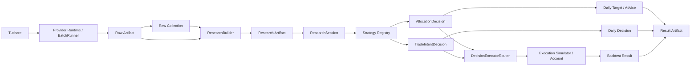

# XQatExp 总体架构

## 1. 系统定位

XQatExp 是一个本地优先、Artifact 驱动的 A 股量化研究与决策系统。核心目标是把数据获取、研究数据、策略决策、执行模拟、每日决策和结果发布拆成清晰的模块，并通过版本化合同连接。

系统不是券商 OMS，不直接提交真实订单，也不承诺实时行情或真实集合竞价微观撮合。所有正式结果都由显式输入生成并发布为可校验 Artifact。

## 2. 顶层数据流



数据和结果均通过 Manifest、SHA-256 和版本化 Schema 校验。策略不直接读取 Raw 文件；回测和 Daily 不直接访问网络。

## 3. 分层与包边界

| 层 | 主要包 | 当前职责 |
| --- | --- | --- |
| CLI / Application | `cli.py`, `application/` | 参数解析、配置解析、用例编排、退出码与失败诊断 |
| Provider / Raw | `providers/tushare/` | 共享 HTTP/限流、能力探测、Raw 抓取/校验、Batch 分区续跑、Collection 索引 |
| Artifact | `artifacts/` | Canonical JSON、Manifest、Schema Registry、原子发布与校验读取 |
| Research | `research/` | Raw→Research 转换、系统因子、受限查询、readiness、自定义因子 |
| Domain | `domain/` | 不可变领域合同、枚举、Issue、数值规范 |
| Strategy | `strategy/`, `strategy/strategies/` | 根目录保存 Registry、Decision/Intent、Schedule、State 等共享机制；具体策略按 strategy id 独立封装 |
| Portfolio | `portfolio/` | Target 校验、transition、手数/现金规划、allocation rebalance |
| Execution / Backtest | `backtest/` | 决策执行、撮合、费用、模拟账户、公司行为、回测主循环 |
| Daily | `daily/` | Daily Target、stateful Daily Decision、AccountSnapshot 与 TradeAdvice |
| Performance | `performance/` | NAV 收益、回撤、Sharpe、Calmar、贡献与阶段分析 |
| Optimization | `optimization/` | 通用离散网格、多进程 evaluator、实验检查点、约束排名与报告；由 application 接入 Registry 和回测工作流 |
| Reporting | `reporting/` | Result 组装、结构化输出、Markdown、Failure Diagnostic |
| Operations / Security | `operations/`, `security.py` | 脱敏运行日志、Token 边界、路径隔离 |

## 4. 核心架构不变量

### 4.1 数据可见性

Research 数据包含 `available_from`，ResearchSession 的查询始终受 decision date 和 strategy declaration 限制。系统因子的 `input_end_date` 不允许晚于 `factor_date`。策略只能读取决策时点已经可见的数据。

### 4.2 Strategy Registry 是唯一策略入口

`strategy/registry.py` 当前注册：

- `weekly_market_guard_rank_v1@1.0.0` + `WeeklyLastTradingDayCloseSchedule`；
- `staged_drawdown_v1@1.0.0` + `DailyCloseSchedule`。

Config、Backtest 和 Daily 都通过 Registry 解析策略，不在 Engine 中按 strategy id 写专用分支。

具体策略位于：

```text
strategy/
├── registry.py
├── decision.py
├── intents.py
├── schedule.py
├── state.py
├── state_io.py
├── state_tools.py
└── strategies/
    ├── weekly_market_guard_rank_v1/
    └── staged_drawdown_v1/
```

`strategy/` 根目录不保存具体策略算法。策略专属参数、declaration、signal/scoring/overlay 和 strategy class 都归属于对应 `strategies/<strategy_id>/`；全局 Registry 是具体策略进入系统的唯一注册点。

### 4.3 两种策略决策

系统的 `StrategyDecision` 是：

- `AllocationDecision`：携带通用 `TargetPortfolio`；
- `TradeIntentDecision`：携带一个或多个 `TradeIntent`。

`DecisionExecutorRouter` 根据决策类型分派到 `AllocationDecisionExecutor` 或 `IntentExecutor`。BacktestEngine 不负责策略专用 sizing。

### 4.4 显式策略状态

需要成交状态的策略通过 `StateRequirement.CONFIRMED_EXECUTION_STATE` 声明。状态由 `StrategyStateReducer` 从 typed AccountEvent 推进，只接受实际成交和已确认公司行为；Daily 不从历史建议推测成交。

### 4.5 决策与执行分离

决策日 D 产生的 allocation target 或 trade intent 必须 `effective_from > D`。当前执行模型为 NEXT_OPEN，使用下一交易日 `open_raw` 加滑点、价格边界、成交量和账户约束生成实际成交。

### 4.6 Artifact 是运行边界

Raw、Research、Backtest Result、Daily Result 和 Failure Diagnostic 都是自包含 Artifact。Collection 索引/报告以独立 Schema 校验，通过相对路径引用 Raw 代次。Artifact 在发布前完整校验，Manifest 记录文件 SHA-256；覆盖写使用 staging/backup/swap 恢复协议。

## 5. 主要运行路径

### 5.1 Raw → Research

单次 fetch 与 fetch-batch 共用 RawFetchService。批次用共享 HTTP Client 和限流器，
按真实交易日/报告期生成分区，发布不可变 Raw 代次，原子更新 Collection 索引和报告。
财务 VIP 来源映射到普通接口对应的 canonical dataset。

完整 Collection 或显式 Raw roots 进入 ResearchBuilder，生成七张 Parquet 表。
Collection 的 Raw update 补洞、追加和刷新窗口；Research build 从完整历史重建。
Research 的 data update 使用 base 与显式 Raw 合并，是单独路径。

Raw Collection 是索引，不改变 Raw Artifact 的物理合同；失败批次不能构建。
命令见 [数据操作指南](data.md)，内部职责见 [数据设计](detailed-design/02-data-and-research.md)。

### 5.2 Backtest

BacktestWorkflow 打开 ResearchSession，执行 readiness，然后将 Strategy、schedule、execution assumptions 和可选 state reducer 交给 BacktestEngine。Engine 按交易日推进账户、公司行为、待执行决策、估值和新决策，最后发布 Result Artifact。

### 5.3 Daily

- allocation 策略：`daily target` 生成 TargetPortfolio；`daily advise` 可结合 AccountSnapshot 生成参考数量。
- stateful 策略：`daily decide` 必须读取 StrategyStateSnapshot，生成 TradeIntentDecision；真实成交后由 `state apply-fill` 更新 state。

### 5.4 参数优化

`backtest opt` 通过 `application/optimization.py` 解析普通配置和优化配置，使用
Registry 规范化全部候选。通用优化库以可序列化 evaluator 为接口，在独立进程中
调用现有 Backtest 工作流。每个试验独立账户和 ResearchSession，发布标准 Result
Artifact；实验根目录单独保存输入指纹、原子检查点与排名，不增加 RunMode。
`backtest opt-report` 校验并合并兼容实验；提供 `--opt-config` 时，从一个完整原始
实验复用已验证的指标，重新判断约束并导出最佳配置，不调用回测。衍生报告通过
来源记录指向原始试验，不复制结果 Artifact。见 [优化指南](optimization.md)。

## 6. 扩展点

新增策略应创建 `strategy/strategies/<strategy_id>/`。allocation 策略至少提供参数 normalizer、declaration 和 strategy factory；stateful 策略还需声明 confirmed state requirement 并产生 TradeIntentDecision。Schedule 在全局 Registry 的 StrategySpec 中绑定。只要使用现有 Decision/Intent 合同，新增策略不需要修改 BacktestEngine、ResearchSession、Account 或 Reporting。

新增数据源或数据集应通过 Provider/Raw 层进入，ResearchBuilder 仍是进入策略可见数据的唯一正规转换路径。

## 7. 安全与平台

Tushare Token 只允许通过当前进程的 `TUSHARE_TOKEN` 环境变量注入。配置禁止 token/secret/password/credential/authorization 类字段。输入输出路径必须互不重叠。

运行时为 CPython 3.12。Linux x86_64 是主平台，Windows 10/11 x64 是兼容平台；具体工程基线见 [工程基线](detailed-design/17-engineering-baseline.md)。
