# 02 CLI 与运行配置

## 1. 职责

CLI 负责固定业务用例的参数接收、配置合并、运行前展示和退出状态；不承载策略、指标或数据修复逻辑。实现使用 Python 标准库 `argparse`，运行配置使用 UTF-8 TOML，避免为 MVP 引入命令框架和 YAML 解析依赖。

## 2. 命令树

```text
xqatexp
  [--log-file PATH]
  self-check
  data fetch
  data capabilities
  data check-raw
  data build
  data update
  data check-research
  factor check
  backtest run
  daily target
  daily advise
  result show
```

### 2.1 数据命令

- `self-check --offline`：检查 Python、依赖、Schema、可写临时目录和内置黄金向量，不访问网络。
- `data capabilities --output PATH`：使用环境变量 Token 执行 04 定义的最小 Tushare 能力探测。
- `data fetch --dataset ID --start DATE --end DATE --output PATH [--existing error|skip|overwrite]`
- `data check-raw --input PATH --report PATH`
- `data build --raw-root PATH --config FILE --output PATH`
- `data update --base PATH --raw-root PATH --config FILE --output PATH`
- `data check-research --input PATH --report PATH`

`fetch` 每次只下载一个数据集和明确范围。重复执行多个数据集由用户或普通 shell 脚本显式完成，系统不提供 DAG。

### 2.2 因子、回测与每日命令

- `factor check --file PATH --research PATH --strategy ID --start DATE --end DATE --report PATH`
- `backtest run --config FILE [业务覆盖项] --output PATH`
- `daily target --config FILE --decision-date DATE [业务覆盖项] --output PATH`
- `daily advise --config FILE --target PATH [--account PATH] --output PATH`
- `result show --input PATH [--format summary|markdown|json]`

所有会发布正式结果的命令都要求显式 `--output`，可以来自 CLI 或配置文件，但解析后不得为空。

可选全局参数 `--log-file PATH` 必须放在业务命令之前；它只追加 13 定义的脱敏 JSONL 运行事件。省略时不创建日志文件，终端仍输出稳定的结果或错误摘要。

## 3. 配置解析

优先级固定为：

```text
CLI 显式业务值 > TOML 运行配置 > 代码公开默认值
```

环境变量只用于秘密和进程运行环境，不覆盖策略、回测、日期、路径或费用等普通业务参数。

```toml
schema_version = "1.0"
mode = "BACKTEST"
strategy_id = "weekly_market_guard_rank_v1"
research_artifact = "D:/xqat/data/research/r20260808"
start_date = "2018-01-01"
end_date = "2025-12-31"
output = "D:/xqat/results/run-001"
analysis_periods = [
  { label = "2024-H2", start_date = "2024-07-01", end_date = "2024-12-31" }
]

[strategy]
rebalance_frequency = "WEEKLY"
entry_rank = 20
exit_rank = 40
custom_factor_name = ""
custom_factor_weight = 0
custom_factor_direction = "HIGHER_BETTER"

[strategy.score_weights]
momentum_60_ex5 = 0.35
momentum_40 = 0.20
trend_stability_60 = 0.15
volume_price_confirm_20 = 0.10
low_volatility_20 = 0.10
profitability = 0.10

[execution]
price_model = "NEXT_OPEN"
slippage_bps = 10
fee_schedule_id = "cn_cash_market_default_v1"
dividend_tax_model = "PROVIDER_AFTER_TAX"
```

TOML 空字符串 `custom_factor_name=""` 在规范化后等价于 null，且要求 `custom_factor_weight=0`。启用时因子文件必须通过 CLI 重复参数 `--custom-factor PATH` 或配置数组显式给出；文件名不能被自动发现。

配置解析步骤：读取 TOML → 校验 Schema 版本 → 合并代码默认值 → 应用 CLI 显式值 → 交叉字段校验 → 解析绝对路径 → 计算输入摘要 → 生成 [ResolvedRunContext](01-shared-contracts.md#2-resolvedruncontext)。

`analysis_periods` 仅在 Backtest 生效。每项必须只含 `label/start_date/end_date`，名称非空且全局唯一，并且不得以 `= + - @` 开头，日期段必须位于回测区间内。数组按起始日、结束日和名称规范排序；阶段可重叠，空数组表示只输出全期和自然年度。同一配置被 CLI 覆盖为 Daily 模式时，该数组规范化为空，避免把回测专用分析项带入每日结果。

## 4. 运行前展示

在任何耗时计算或正式写入之前，以稳定顺序展示：

- 模式、策略及版本；
- 最终参数；
- 日期范围或决策日；
- Research Artifact 路径别名和摘要；
- 用户因子名称、路径别名和摘要；
- AccountSnapshot 是否提供；
- AccountSnapshot 的管理范围和持仓完整性（若提供）；
- 成交、滑点与费用假设；
- 输出路径和覆盖策略。

展示不要求交互确认。秘密值必须替换为 `<redacted>`。

## 5. 用例编排

```mermaid
sequenceDiagram
    actor U as User
    participant C as CLI
    participant R as ConfigResolver
    participant A as ApplicationService
    participant P as ArtifactPublisher

    U->>C: 命令 + 配置
    C->>R: 解析并合并
    R-->>C: ResolvedRunContext
    C->>C: 展示最终配置
    C->>A: 执行固定用例
    alt 成功
        A-->>P: StructuredResult
        P-->>C: PublishedArtifact
        C-->>U: 摘要 + 输出路径
    else 业务失败
        A-->>C: RunFailure
        C-->>U: 明确问题与建议
    end
```



## 6. 退出码

| 退出码 | 含义 |
|---:|---|
| 0 | 用例成功；结果可以包含 WARNING。 |
| 2 | CLI 用法或配置 Schema 错误。 |
| 3 | 业务前置条件失败，例如必需数据、权限或因子缺失。 |
| 4 | 输入或输出 Artifact 损坏、冲突、已有路径或发布失败。 |
| 5 | 外部数据服务调用失败且重试耗尽。 |
| 10 | 未分类内部异常；输出脱敏关联号，不输出秘密或完整堆栈到普通终端。 |

## 7. 失败规则

- 参数非法时不得访问数据或创建输出目录。
- Backtest 运行中失败时不得发布正式结果。
- `daily advise` 缺少账户文件不是命令失败；它按字段级降级规则生成仍然可靠的目标相关信息。
- `factor check` 和数据检查命令发布的是检查报告，不是策略成功结果。
- `data capabilities` 缺少 `TUSHARE_TOKEN` 时以退出码 3 和 `SECURITY_SECRET_MISSING` 结束，不创建伪能力报告。

## 8. 测试要点

- 对每个优先级组合做表驱动测试。
- 环境变量中伪造同名业务参数不得改变解析值。
- 每个命令的 `--help`、必填项、日期边界和路径冲突均有测试。
- 运行前展示内容与最终 Manifest 的业务值逐字段一致。
- 含 token 的输入和异常不得出现在捕获的 stdout、stderr 或日志中。
