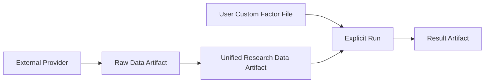
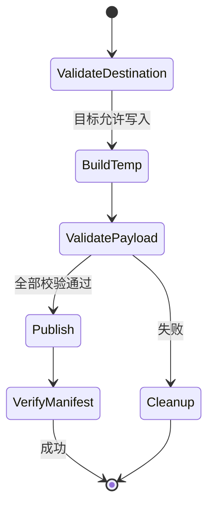

# 03 Artifact 与存储

## 1. Artifact 分类



四类 Artifact 彼此独立。用户因子保持外部文件，不复制进 Research Artifact；Raw 不直接供 Strategy 使用。

## 2. 通用 Manifest 信封

所有系统管理的 Artifact 根目录包含 `manifest.json`，通用字段为：

```json
{
  "schema_version": "1.0",
  "artifact_type": "RESEARCH_DATA",
  "artifact_id": "r-20260808-001",
  "created_at": "2026-08-08T03:00:00Z",
  "producer": {"name": "xqatexp", "version": "1.0.0"},
  "inputs": [],
  "date_scope": {"start": "2018-01-01", "end": "2026-08-07"},
  "files": [],
  "issues": [],
  "limitations": []
}
```

完整字段、条件必填和物理类型由 [16 物理 Schema 注册表](16-physical-schemas.md#3-artifact-manifest-10) 唯一定义。根 Manifest 的内容摘要由读取方现场计算，不在自身内部递归保存。

## 3. Raw Data Artifact

```text
data/raw/tushare/<dataset_id>/
  request=<request_id>/
    request.json
    response.jsonl.gz
    manifest.json
```

- `request.json` 保存脱敏后的接口名、字段、范围、分页和请求时间，不保存 token。
- `response.jsonl.gz` 逐行保存供应商原始字段名和值；不进行业务重命名、复权或估算。
- 每个请求单元独立发布，便于重试和定位。
- 同一目标的 `error`、`skip`、`overwrite` 语义由 [04 原始数据获取](04-raw-data.md) 定义。

## 4. Unified Research Data Artifact

```text
data/research/<research_dataset_id>/
  manifest.json
  tables/
    security_master/part-*.parquet
    trade_calendar/year=YYYY/part-*.parquet
    market_daily/year=YYYY/month=MM/part-*.parquet
    security_status/year=YYYY/month=MM/part-*.parquet
    financial_snapshot/year=YYYY/part-*.parquet
    corporate_action/year=YYYY/part-*.parquet
    system_factor_daily/year=YYYY/month=MM/part-*.parquet
  checks/
    validation.json
    coverage.parquet
```

- Parquet 是正式持久化事实；DuckDB 数据库文件不进入 Artifact。
- 分区键不重复编码业务事实；表内仍保留日期字段。
- 一个发布版本必须是内部一致的完整快照，增量更新不能暴露中间状态。
- Manifest 记录 Raw 输入摘要、构建配置摘要、表 Schema 版本和覆盖范围。

## 5. 用户自定义因子文件

用户文件使用 UTF-8 CSV，物理 Schema 由 [06 Research Access](06-research-access.md#5-用户自定义因子-schema) 唯一定义。系统只读取、校验和连接，不将其复制到 Research Artifact 或长期 Registry。

## 6. Result Artifact

### 6.1 Backtest

```text
<output>/
  manifest.json
  resolved_config.json
  target_history.parquet
  portfolio_daily.parquet
  trades.parquet
  unfilled.parquet
  metrics.json
  period_metrics.csv
  issues.json
  report.md
```

### 6.2 Daily Target

```text
<output>/
  manifest.json
  resolved_config.json
  target_portfolio.json
  target_positions.csv
  issues.json
  report.md
```

### 6.3 Daily Advice

在 Daily Target 文件基础上增加 `trade_advice.json` 和 `trade_advice.csv`。AccountSnapshot 原文不复制进结果；Manifest 只记录输入摘要和是否提供关键字段。

结构化文件是事实来源，完整 Schema 见 [16 物理 Schema 注册表](16-physical-schemas.md)。`report.md` 只格式化这些事实。

## 7. 原子发布



算法：

1. 将目标解析为绝对路径，拒绝危险根路径和非预期符号链接跳转。
2. 目标存在时，正式结果默认 `ERROR`；Raw 可按显式策略处理。
3. 在目标同一父目录创建唯一临时目录。
4. 写入全部文件并关闭句柄，计算大小、行数和 SHA-256。
5. 最后写 Manifest，并执行 Schema、引用和业务校验。
6. 同卷原子重命名临时目录为正式目标。
7. 显式覆盖时先构建新临时目录，再使用 [17 §7](17-engineering-baseline.md#7-跨平台原子发布与-windows-覆盖算法) 的平台适配和可恢复交换协议；失败不得破坏最后一个已验证完整产物。

## 8. 兼容性

- 每种 Artifact 有独立 `schema_version`，使用 `major.minor`。
- Major 不兼容时读取失败；Minor 新字段必须可忽略。
- 读取方不根据文件名猜测 Schema，必须先读 Manifest。
- 系统不自动迁移或覆盖旧 Artifact；迁移必须是未来显式命令。

## 9. 测试要点

- 进程在每个写入阶段被终止时，正式路径必须保持不存在或仍为旧完整版本。
- 修改任一文件后 Manifest 摘要校验必须失败。
- 结果路径已存在时默认失败且不修改原内容。
- 路径遍历、符号链接逃逸和秘密字段进入 Manifest 均被拒绝。
- Result 中结构化值与 Markdown 报告抽样字段一致。
