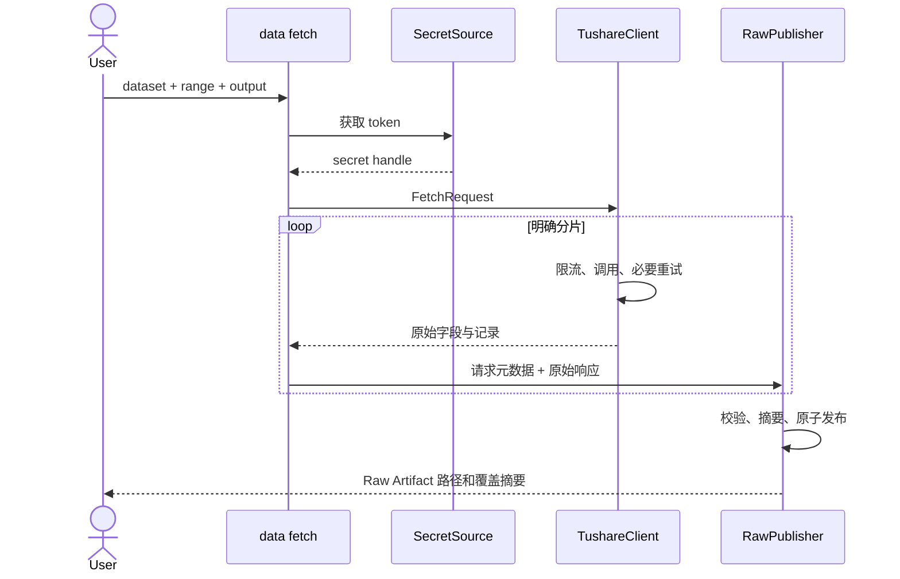

# 04 原始数据获取与检查

## 1. 范围与供应商适配

MVP 只实现 Tushare 适配器，但领域层使用内部 `dataset_id`，不让供应商字段进入下游 Strategy。Tushare 的 API 通过一个最小 `TushareClient` 封装，负责认证、限流、重试和原始响应返回。

官方资料确认 `daily` 为未复权 A 股日线、`adj_factor` 为股票复权因子、`fund_adj` 为基金复权因子、`trade_cal` 为交易日历，且 `daily_basic` 提供市值和换手等每日指标。详细设计以这些供应商语义为 Raw 输入，不把它们直接视为统一研究语义：

- [A股日线行情](https://tushare.pro/document/1?doc_id=27)
- [复权因子](https://tushare.pro/document/2?doc_id=28)
- [交易日历](https://tushare.pro/document/2?doc_id=26)
- [每日指标](https://tushare.pro/document/2?doc_id=32)
- [历史 ST 股票列表](https://tushare.pro/document/2?doc_id=397)
- [ETF 日线](https://tushare.pro/document/2?doc_id=127)
- [基金复权因子](https://tushare.pro/document/2?doc_id=199)
- [分红送股](https://tushare.pro/document/2?doc_id=103)
- [积分与频次](https://tushare.pro/document/1?doc_id=290)

## 2. 数据集目录

| dataset_id | 精确接口 | 固定请求分片 | 必须请求的原始字段 | 业务键 | 当前官方积分门槛 |
|---|---|---|---|---|---:|
| `stock_basic` | `stock_basic` | `exchange in {SSE,SZSE}` × `list_status in {L,D,P,G}` | `ts_code,symbol,name,market,exchange,curr_type,list_status,list_date,delist_date` | `ts_code`（合并状态请求后） | 2000 |
| `trade_calendar` | `trade_cal` | `exchange=SSE`，按自然年 | `exchange,cal_date,is_open,pretrade_date` | `exchange,cal_date` | 2000 |
| `stock_daily` | `daily` | 每个开放 `trade_date` | `ts_code,trade_date,open,high,low,close,pre_close,change,pct_chg,vol,amount` | `ts_code,trade_date` | 基础积分；实测 |
| `stock_adj_factor` | `adj_factor` | 每个开放 `trade_date` | `ts_code,trade_date,adj_factor` | `ts_code,trade_date` | 2000 |
| `stock_daily_basic` | `daily_basic` | 每个开放 `trade_date` | `ts_code,trade_date,close,turnover_rate,total_mv,circ_mv` | `ts_code,trade_date` | 2000 |
| `stock_suspend` | `suspend_d` | 每个开放 `trade_date`，`suspend_type=S` | `ts_code,trade_date,suspend_timing,suspend_type` | `ts_code,trade_date,suspend_type` | 2000 |
| `stock_price_limit` | `stk_limit` | 每个开放 `trade_date` | `ts_code,trade_date,pre_close,up_limit,down_limit` | `ts_code,trade_date` | 2000 |
| `stock_st_status` | `stock_st` | 每个开放 `trade_date` | `ts_code,name,trade_date,type,type_name` | `ts_code,trade_date` | 3000 |
| `fund_basic` | `fund_basic` | `market=E`，分别取 `status=L,D` | `ts_code,name,fund_type,list_date,delist_date,status,market` | `ts_code`（合并状态请求后） | 2000 |
| `fund_daily` | `fund_daily` | 指定 ETF，每段最多 1000 个交易日 | `ts_code,trade_date,open,high,low,close,pre_close,change,pct_chg,vol,amount` | `ts_code,trade_date` | 5000 |
| `fund_adj_factor` | `fund_adj` | 指定 ETF，每段最多 1000 个交易日，使用 `offset,limit` 保护 | `ts_code,trade_date,adj_factor` | `ts_code,trade_date` | 接口页 2000；实测 |
| `index_daily` | `index_daily` | `ts_code=000300.SH`，每段最多 1000 个交易日 | `ts_code,trade_date,open,high,low,close,pre_close,change,pct_chg,vol,amount` | `ts_code,trade_date` | 2000 |
| `income` | `income` | 每只股票、每 8 个报告期窗口 | `ts_code,ann_date,f_ann_date,end_date,report_type,comp_type,n_income_attr_p,update_flag` | `ts_code,end_date,report_type,ann_date,f_ann_date,update_flag` | 2000 |
| `fina_indicator` | `fina_indicator` | 每只股票、每 8 个报告期窗口 | `ts_code,ann_date,end_date,roe,roe_waa,roe_yearly,profit_dedt,update_flag` | `ts_code,end_date,ann_date,update_flag` | 2000；`fina_indicator_vip` 5000 可选加速 |
| `dividend` | `dividend` | 每只回测持仓候选股票 | `ts_code,end_date,ann_date,div_proc,stk_div,stk_bo_rate,stk_co_rate,cash_div,cash_div_tax,record_date,ex_date,pay_date,div_listdate,imp_ann_date` | `ts_code,end_date,ann_date,div_proc,record_date,ex_date` | 2000 |

表中的积分是 2026-09-05 官方页面陈述，不是当前 Token 的权限证明。启动真实下载前必须逐接口做能力探测，并把实际接口名、返回字段和结论记录为脱敏 `provider_capabilities.json`。`fina_indicator_vip` 只有在探测成功时替代逐证券 `fina_indicator`，两者生产完全相同的 Raw 逻辑字段；切换必须写入 Manifest，不能静默发生。

`stock_st` 是 MVP 唯一历史 ST 来源；不使用需 6000 积分的 `st` 接口，也不使用证券当前名称倒推历史状态。官方说明 `stock_st` 从 2000-01-01 起，早于该日期的回测不受支持。`suspend_d` 的 `suspend_type=S` 记录覆盖停牌期间每日状态；`suspend_timing` 为空表示全天停牌，非空表示日内时段且 MVP 日线执行模型将其标记为质量限制而非直接判定全天停牌。

指定沪深300ETF代码由运行配置显式给出，并以 `fund_basic` 的场内、已上市状态验证；名称或业绩比较基准不能自动替代白名单。`fund_adj` 与 `fund_daily` 必须成对覆盖同一交易日。沪深300基准固定 `000300.SH`，若供应商返回不同代码不得自动替换。

单位转换只在 Data Preparation 发生：日线 `vol` 为手、`amount` 为千元；`daily_basic.total_mv/circ_mv` 为万元；价格为元。Raw 保留供应商原值和单位元数据。

## 3. 能力探测

在大范围下载前，对上表每个必需接口执行一个最小请求：主数据取固定小字段集，日频接口取最近一个已完成开放日，证券历史接口取一个明确证券和不超过五日/一个报告期的范围。探测只有同时满足以下条件才记为 `AVAILABLE`：供应商响应码为 0、返回字段包含登记字段、Schema 可解析。空结果按接口业务语义单独判断，不能仅凭响应码认定可用。

能力状态为 `AVAILABLE`、`PERMISSION_DENIED`、`EMPTY_BUT_AUTHORIZED`、`SCHEMA_MISMATCH`、`TRANSIENT_FAILURE`。Tushare HTTP `code=2002` 映射为 `PERMISSION_DENIED`。探测不在接口间推断权限：5100 积分只用于选择待探测接口，不直接生成成功结论。

## 4. 获取请求

`FetchRequest` 包含：`dataset_id`、`start_date`、`end_date`、`security_ids`（可空）、`fields`、`output_path`、`existing_policy`。

规则：

- 日期范围两端闭区间。
- 全市场日频数据优先按 `trade_date` 分片，避免逐证券下载导致不可控请求量。
- 证券主数据分别获取上市、退市等状态，不能只取当前上市集合作为历史证券池。
- 每次请求保存供应商字段列表、查询参数和响应行数。
- 供应商空响应只有在业务上允许为空时才成功；否则产生 `DATA_PROVIDER_EMPTY_RESPONSE`。

空响应规则：某开放日 `stock_suspend` 或 `stock_st_status` 成功空响应表示当日无相应证券；`dividend` 对单只证券可为空；主数据、交易日历、开放日行情、复权因子、每日指标、涨跌停、指定 ETF 和指数在期望有数据时为空均失败。财务数据对单只证券为空允许保存，但该证券在下游按财务缺失规则排除。

## 5. 限流、重试与权限

- token 只从本地秘密源 `TUSHARE_TOKEN` 读取，并仅传入 `TushareClient`。
- 客户端使用令牌桶限制调用；具体速率来自本地非秘密 provider 配置，不在业务策略中硬编码。
- 网络超时、HTTP 429 和供应商临时错误使用带抖动的指数退避，默认最多 5 次。
- 参数错误、权限错误、认证错误不重试。
- Tushare 返回权限不足时映射为 `DATA_PROVIDER_PERMISSION_DENIED`，证据只记录接口和字段，不记录 token。
- 下载失败不发布该请求单元的正式 Raw Artifact。

## 6. 已有文件策略

| 策略 | 行为 |
|---|---|
| `error` | 默认；目标存在即失败。 |
| `skip` | 只检查目标存在后跳过，并发出“未重新验证完整性”的 WARNING。 |
| `overwrite` | 完整下载到临时位置、校验后安全替换。 |

`skip` 不读取 Manifest 来声称内容完整；如需完整性结论，应运行 `data check-raw`。

## 7. Raw 检查

检查只发现并报告，不修复：

- 压缩文件可读、JSON 行可解析；
- 响应字段与请求记录一致；
- 响应字段必须至少覆盖接口注册表的固定字段，新增供应商字段可以保留但不自动进入下游；
- 业务键在单请求和跨请求合并范围内不重复；
- 日期、证券代码和数值字段可解析；
- 请求日期范围与响应日期不冲突；
- 开放交易日的预期分片存在；
- 必需数据集权限和覆盖满足指定研究区间；
- 同一供应商记录存在冲突时报告全部来源，不选择“看起来正确”的值。

## 8. 数据流

## 9. 测试要点

- 模拟超时、429、权限不足、空响应、字段变化和分页重复。
- 验证重试不会重复发布或丢失请求单元。
- 验证当前上市列表不能替代历史上市范围。
- 验证 ST 覆盖从指定起始日不足时，就绪检查得到确定的 ERROR。
- 验证 `stock_st` 成功空响应与权限拒绝产生不同能力状态。
- 验证 ETF 日线与 `fund_adj` 覆盖不一致时构建失败。
- 验证所有供应商单位只在 Data Preparation 转换，Raw 值不改变。
- 捕获所有日志和异常，确认 token 及其片段均未出现。
