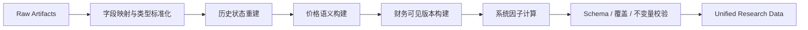

# 05 统一研究数据与系统因子

## 1. 构建职责

Data Preparation 将 Raw Artifact 转换为供应商无关、满足历史可见性约束的 Parquet 研究数据。它执行明确转换和验证，不插值、不猜测、不把缺失值默认为零。



## 2. 逻辑表 Schema

### 2.1 `security_master`

主键：`security_id`。

| 字段 | 类型 | 说明 |
|---|---|---|
| `security_id` | string | 统一证券标识。 |
| `symbol` | string | 六位交易代码。 |
| `exchange` | string | `SH` 或 `SZ`。 |
| `asset_type` | enum | A_SHARE、CSI300_ETF 或 CSI300_INDEX。 |
| `currency` | string | 固定 CNY。 |
| `list_date` | date | 上市日期。 |
| `delist_date` | date/null | 退市日期。 |
| `buy_lot_size` | int | 买入最小数量单位。 |
| `sell_lot_size` | int | 常规卖出单位；零股清仓规则由执行模块处理。 |
| `price_tick` | decimal | 价格最小变动单位。 |
| `source_hash` | string | 来源记录摘要。 |

ETF 是否跟踪沪深300必须由明确的白名单配置和基金主数据共同确认；不能只按名称模糊匹配。基准指数固定 `000300.SH`。

MVP 版本化交易规则：普通 A 股买入/常规卖出单位为 100 股、价格最小变动单位为 0.01 CNY；沪深300ETF 买入/常规卖出单位为 100 份、价格最小变动单位为 0.001 CNY。全部退出允许卖出不足一手的剩余数量。规则随 `effective_from` 版本化，运行使用交易日有效版本。

### 2.2 `trade_calendar`

主键：`exchange, calendar_date`。

字段：`exchange`、`calendar_date`、`is_open`、`previous_trade_date`、`next_trade_date`、`source_hash`。沪深日历不一致时，A 股/ETF 用例只接受两市共同开放日；不一致日期产生 ERROR。

### 2.3 `market_daily`

主键：`security_id, trade_date`。

| 字段 | 类型 | 说明 |
|---|---|---|
| `security_id` | string | A 股、ETF 或指数。 |
| `trade_date` | date | 交易日期。 |
| `open_raw` / `high_raw` / `low_raw` / `close_raw` | decimal/null | 未复权真实价格。 |
| `pre_close_raw` | decimal/null | 供应商昨收口径。 |
| `volume_shares` | int/null | 统一转换为股。 |
| `amount_cny` | decimal/null | 统一转换为人民币元。 |
| `adj_factor` | decimal/null | 股票或 ETF 复权因子；指数为 1。 |
| `research_open` / `research_high` / `research_low` / `research_close` | decimal/null | 连续研究价格。 |
| `available_from` | date | 正常为 `trade_date`。 |
| `quality_flags` | list[string] | 明确质量标记。 |

研究价格公式：

```text
research_price(t) = raw_price(t) × adj_factor(t) / first_valid_adj_factor
```

`first_valid_adj_factor` 是该证券研究覆盖范围最早可用因子，只作固定尺度归一化；收益计算只使用比例。执行和账户估值永远使用未复权真实价格及独立公司行为事件。

### 2.4 `security_status_daily`

主键：`security_id, trade_date`。

字段：`is_listed`、`listing_trade_days`、`is_st`、`is_suspended_full_day`、`up_limit`、`down_limit`、`is_limit_up_locked`、`is_limit_down_locked`、`risk_flags`、`available_from`、`source_hash`。

锁板判定只用于日线保守成交模型：

```text
is_limit_up_locked   = low_raw >= up_limit - price_tick_tolerance
is_limit_down_locked = high_raw <= down_limit + price_tick_tolerance
```

`price_tick_tolerance = price_tick / 2`，所有值先按原始 Decimal 比较，不先转 float。缺少官方涨跌停价格时不得仅用固定百分比猜测。

### 2.5 `financial_snapshot`

业务键：`security_id, report_period, announce_date, revision_seq`。

字段：`security_id`、`report_period`、`announce_date`、`available_from`、`revision_seq`、`net_profit_parent_ytd`、`net_profit_parent_quarter`、`net_profit_parent_ttm`、`roe_annualized`、`consecutive_loss_quarters`、`source_hash`。

规则：

- `announce_date` 优先使用 `income.f_ann_date`（实际公告日），为空时才使用 `ann_date`；`available_from` 为该公告日后的第一个共同交易日；
- `net_profit_parent_ytd` 映射 `income.n_income_attr_p`，供应商万元单位转换为 CNY；同一报告期只选择当时可见的最新 `update_flag` 版本；
- 单季度净利润：Q1 等于当期累计；Q2/Q3 等于当期累计减同年度上一累计期；年报季度值等于全年累计减 Q3 累计。缺任一构成项则为 null，不估算；
- 非年报 TTM = 当年累计 + 上一完整年度累计 - 上年同期累计；年报 TTM = 当年全年累计。三个构成记录都必须在当前 Slice 可见；
- `roe_annualized` 映射同一报告期最新可见 `fina_indicator.roe_yearly / 100`。供应商没有 ROE TTM 字段，因此系统不把 `roe` 或 `roe_waa` 重命名成 TTM；
- `consecutive_loss_quarters` 是截至当前版本连续单季度净利润小于 0 的季度数，遇 null 终止计数；
- 修订版本保留，不覆盖原历史版本；
- 查询 H 时选择 `available_from <= H` 的最大可见版本；
- 无法确定公告日期的记录不得进入历史策略输入。

### 2.6 `system_factor_daily`

主键：`factor_id, security_id, factor_date, factor_version`。

字段：`factor_id`、`factor_version`、`security_id`、`factor_date`、`value`、`available_from`、`input_start_date`、`input_end_date`、`quality_flags`。

### 2.7 `corporate_action`

主键：`event_id`。字段：`event_id`、`security_id`、`action_type`（CASH_DIVIDEND、STOCK_DISTRIBUTION、SPLIT、RIGHTS_ISSUE、OTHER）、`announce_date`、`implementation_announce_date`、`record_date`、`ex_date`、`pay_date`、`stock_list_date`、`cash_per_share_before_tax`、`cash_per_share_after_tax`、`stock_ratio`、`split_ratio`、`rights_ratio`、`rights_price`、`available_from`、`source_hash`。

不适用字段为 null。现金分红至少要求 record/ex/pay 日期和每股现金；送股/拆并股至少要求生效日期和比例。互相冲突或无法确定生效顺序的事件使构建失败。该表只提供给 ExecutionDataView 和结果限制说明，不提供给 Strategy 任意查询。

### 2.8 Parquet 物理类型与空值

全部表使用 ZSTD Parquet，通用类型遵循 [16 §2](16-physical-schemas.md#2-通用物理类型与规范)。下列 `?` 表示可空；未标记列不可空，列顺序即物理顺序：

- `security_master`：`security_id:string, symbol:string, exchange:string, asset_type:string, currency:string, list_date:date32, delist_date:date32?, buy_lot_size:int64, sell_lot_size:int64, price_tick:decimal128(18,6), rule_effective_from:date32, source_hash:string`；
- `trade_calendar`：`exchange:string, calendar_date:date32, is_open:bool, previous_trade_date:date32?, next_trade_date:date32?, source_hash:string`；
- `market_daily`：`security_id:string, trade_date:date32, open_raw:decimal128(18,6)?, high_raw:decimal128(18,6)?, low_raw:decimal128(18,6)?, close_raw:decimal128(18,6)?, pre_close_raw:decimal128(18,6)?, volume_shares:int64?, amount_cny:decimal128(24,4)?, adj_factor:decimal128(24,12)?, research_open:decimal128(24,10)?, research_high:decimal128(24,10)?, research_low:decimal128(24,10)?, research_close:decimal128(24,10)?, available_from:date32, quality_flags:list<string>`；
- `security_status_daily`：`security_id:string, trade_date:date32, is_listed:bool, listing_trade_days:int32, is_st:bool?, is_suspended_full_day:bool?, up_limit:decimal128(18,6)?, down_limit:decimal128(18,6)?, is_limit_up_locked:bool?, is_limit_down_locked:bool?, risk_flags:list<string>, available_from:date32, source_hash:string`；
- `financial_snapshot`：`security_id:string, report_period:date32, announce_date:date32, available_from:date32, revision_seq:int32, net_profit_parent_ytd:decimal128(24,4)?, net_profit_parent_quarter:decimal128(24,4)?, net_profit_parent_ttm:decimal128(24,4)?, roe_annualized:decimal128(18,12)?, consecutive_loss_quarters:int32?, source_hash:string`；
- `system_factor_daily`：`factor_id:string, factor_version:string, security_id:string, factor_date:date32, value:float64?, available_from:date32, input_start_date:date32?, input_end_date:date32, quality_flags:list<string>`；
- `corporate_action`：`event_id:string, security_id:string, action_type:string, announce_date:date32, implementation_announce_date:date32?, record_date:date32?, ex_date:date32?, pay_date:date32?, stock_list_date:date32?, cash_per_share_before_tax:decimal128(18,6)?, cash_per_share_after_tax:decimal128(18,6)?, stock_ratio:decimal128(18,12)?, split_ratio:decimal128(18,12)?, rights_ratio:decimal128(18,12)?, rights_price:decimal128(18,6)?, available_from:date32, source_hash:string`。

表内行按主键升序。`source_hash` 是产生该统一记录的有序 Raw 记录摘要集合的 SHA-256；同一业务事实由多条 Raw 构成时先按供应商业务键排序再摘要。

## 3. 系统因子注册表

所有窗口均按交易日计，要求窗口内价格完整；默认不以旧值填补。

| factor_id | 公式与语义 | 最小历史 |
|---|---|---:|
| `total_mv_pct_v1` | D 日总市值在当日可比较 A 股中的升序百分位 | 1 |
| `amount_20d_pct_v1` | 近 20 日平均成交额的升序百分位 | 20 |
| `momentum_60_ex5_v1` | `research_close[D-5] / research_close[D-60] - 1` | 61 |
| `momentum_40_v1` | `research_close[D] / research_close[D-40] - 1` | 41 |
| `trend_stability_60_v1` | 对近 60 日 `log(research_close)` 与序号做 OLS 的 R²；斜率非正时记 0 | 60 |
| `volume_price_confirm_20_v1` | `ln(mean(amount | return>0) / mean(amount | return<0))`，比例裁剪到 `[0.25,4]` 后计算 | 21 |
| `volatility_20_v1` | 近 20 个日对数收益样本标准差 × `sqrt(252)` | 21 |
| `roe_annualized_v1` | D 日可见的最新供应商年化 ROE，百分数转换为比例；不冒充 TTM | 财务依赖 |
| `profit_positive_ttm_v1` | 最新可见归母净利润 TTM 是否大于 0 | 财务依赖 |
| `consecutive_loss_2_v1` | 最新两个可见单报告期归母净利润是否均小于 0 | 财务依赖 |
| `etf_ma20_v1` | 指定沪深300ETF 近 20 日研究收盘均值 | 20 |
| `etf_ma60_v1` | 指定沪深300ETF 近 60 日研究收盘均值 | 60 |
| `etf_slope60_v1` | 近 60 日对数价格 OLS 年化斜率 | 60 |
| `etf_drawdown60_v1` | `close[D] / max(close[D-59:D]) - 1` | 60 |
| `etf_volatility20_v1` | ETF 近 20 日年化波动 | 21 |

百分位总体为 D 日 `is_listed=true`、`is_st=false`、相关原始字段有效的普通 A 股。样本少于 500 只时百分位因子不可用并产生 ERROR，避免以严重残缺截面运行。

`volume_price_confirm_20_v1` 的上涨日或下跌日少于 3 个时为 null 并标记 `INSUFFICIENT_UP_DOWN_OBSERVATIONS`，不使用无穷大或人为上限代替缺失。

截面评分由 Strategy 执行：先对各因子在最终合格股票池内按 1%/99% 分位缩尾，再计算稳定百分位；这避免 System Factor 将特定策略权重固化进研究数据。

## 4. 确定性数值算法

### 4.1 收益、波动和动量

简单收益为 `p_t / p_(t-1) - 1`；对数收益为 `ln(p_t / p_(t-1))`。波动率使用窗口内对数收益的样本标准差（分母 `n-1`）乘 `sqrt(252)`。任何价格不完整或非正时整个窗口结果为 null 并标记 `INSUFFICIENT_HISTORY`，不跳过缺失日缩短窗口。

### 4.2 分位数、缩尾与百分位

对有限值升序排序，q 分位采用 Hyndman–Fan Type 7：`h=(n-1)q`，在 `floor(h)` 与 `ceil(h)` 的值之间线性插值。缩尾为 `min(max(x,Q_0.01),Q_0.99)`。

百分位先对缩尾值使用平均秩 `r`（最小秩从 1 开始），再计算 `p=(r-1)/(n-1)`。`n=1` 时结果为 null；同值获得相同百分位。最终稳定排序才使用 `security_id ASC`，证券代码不会改变百分位值。

### 4.3 OLS

窗口按交易日升序，`x=0..n-1`，`y=ln(research_close)`；使用带截距普通最小二乘。若 x 或 y 方差为零则斜率或 R² 不可用。`trend_stability_60_v1` 在斜率 `beta<=0` 时为 0，否则为标准 `1-SSE/SST`。`etf_slope60_v1 = exp(beta*252)-1`。

### 4.4 量价配合

在 20 个收益观察中，分别对简单收益大于 0 和小于 0 的日期计算 `amount_cny` 算术均值，收益等于 0 的日期不进入两组。任一组少于 3 个有效观察则结果为 null。否则 `ratio=clip(up_mean/down_mean,0.25,4)`，因子值为 `ln(ratio)`。

所有因子先以 float64 计算且必须有限；写入前将 `-0.0` 规范化为 `0.0`。排序比较使用未展示的完整 float64 值，展示四舍五入不参与排序。

## 5. 标记目录、缺失与异常规则

`quality_flags` 唯一允许值：

| 代码 | 含义 |
|---|---|
| `SOURCE_NULL` | 必需供应商字段为空。 |
| `UNEXPLAINED_MISSING_PRICE` | 开放日缺行情且无停牌事实。 |
| `SUSPENDED_NO_PRICE` | 全天停牌导致无行情，属于可解释缺失。 |
| `ADJ_FACTOR_MISSING` | 行情存在但复权因子缺失。 |
| `PRICE_INVARIANT_FAILED` | OHLC 或价格正值约束失败。 |
| `INSUFFICIENT_HISTORY` | 完整窗口不足。 |
| `INSUFFICIENT_UP_DOWN_OBSERVATIONS` | 量价因子上涨/下跌组不足。 |
| `FINANCIAL_VERSION_AMBIGUOUS` | 财务修订顺序不能唯一确定。 |
| `CORPORATE_ACTION_INCOMPLETE` | 公司行为日期或数值不足。 |
| `INTRADAY_SUSPENSION_UNMODELED` | 日内停牌无法由日线模型精确表达。 |
| `CROSS_SOURCE_CONFLICT` | 多来源同一事实不一致。 |

`risk_flags` 唯一允许值：`DELISTING_PERIOD`、`TERMINATION_CONFIRMED`、`DATA_CONFLICT`、`ST_COVERAGE_MISSING`、`PRICE_LIMIT_MISSING`、`VALUATION_UNAVAILABLE`、`CORPORATE_ACTION_AMBIGUOUS`。前四项禁止证券进入 Strategy 股票池；后三项由执行/估值层按对应日期决定 FAILED、UNFILLED 或限制，Strategy 不自行解释。

- 价格、状态、市值、成交额或财务字段缺失时保留 null，并记录质量标记。
- Strategy 可以静态声明“该证券排除”的缺失策略；不得由 Data Preparation 自行排除。
- 重复业务键且内容一致时保留一条并记录来源；内容冲突时构建失败。
- OHLC 违反 `low <= open/close <= high`、负成交量、非正价格等确定性错误使受影响构建失败。
- 停牌日没有行情是允许状态，但必须有停牌事实；无行情且无停牌依据视为未解释缺失。

## 6. 完整构建与增量更新

完整构建按逻辑表依赖顺序执行。增量更新流程：

1. 校验基础 Research Artifact 完整性；
2. 读取新增 Raw 输入并计算受影响证券和日期；
3. 行情/复权变化向前扩展 61 个交易日，财务修订从其 `available_from` 起重算；
4. 在独立 staging 目录重写受影响分区，复用未变分区内容；
5. 对最终完整快照运行所有跨表校验；
6. 发布新的独立 Research Artifact，不原地修改旧 Artifact。

## 7. 发布校验

- 所有表 Schema 和主键唯一；
- `security_id` 均可引用主表；
- 交易日期属于日历开放日；
- `available_from` 不早于信息实际可用日期；
- 状态覆盖、行情覆盖、财务覆盖和因子覆盖按日期与证券统计；
- System Factor 的输入区间不超过 `factor_date`；
- 随机抽样重算和全量边界断言通过；
- Manifest 中每表的日期、行数和摘要与文件一致。

## 8. 测试要点

- 将未来行情或未来公告值注入 Raw 后，过去日期因子必须不变。
- 同一报告期修订不得改变修订可见日前的查询结果。
- 复权事件前后研究收益连续，而模拟账户仍通过公司行为独立变化。
- 完整构建与基于相同 Raw 集合的增量构建逐表内容摘要一致。
- 缺失 ST 覆盖、公告日期或涨跌停价时不得产生伪完整字段。
- 分位数 Type 7、平均秩百分位、OLS 年化和 TTM 拼接分别使用可手算黄金向量验证。
- `roe_yearly` 映射为 `roe_annualized`，任何输出字段和因子不得再命名为 ROE TTM。
