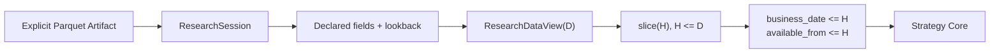
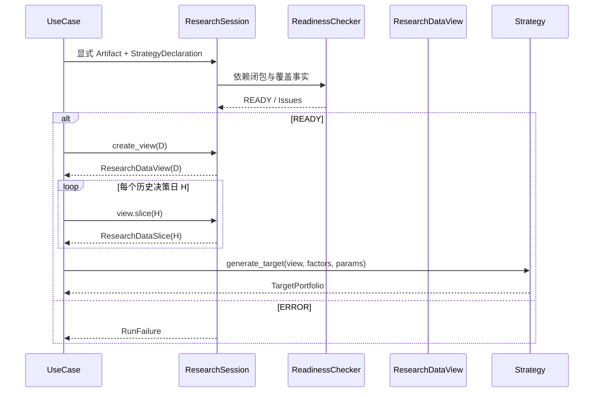

# 06 Research Access、自定义因子与就绪检查

## 1. ResearchSession

每次用例创建一个进程内 `ResearchSession`：

1. 读取显式 Research Artifact Manifest；
2. 校验 Schema Major 版本和文件摘要；
3. 创建内存 DuckDB connection；
4. 将明确的 Parquet 路径注册为只读视图；
5. 计算当前策略依赖闭包并执行就绪检查；
6. 为每个决策日构造受限 View；
7. 用例结束后关闭 connection，不保存 DuckDB 数据库文件。

DuckDB SQL 只存在于 `research` 包内部。Strategy 不获得 connection、路径或 SQL 字符串。

## 2. ResearchDataView(D) 与历史 Slice



View 和 Slice 实现 [共享 Protocol](01-shared-contracts.md#4-researchdataviewresearchdataslice-与-customfactorview)，并强制：

- 顶层 View 只暴露交易日序列和创建历史 Slice 的能力，不直接返回 D 日股票池；
- `slice(H)` 的所有返回记录 `trade_date/factor_date <= H`；
- Slice 中所有版本记录 `available_from <= H`，不能因外层 View 的 D 更晚而看到后来修订；
- 只允许 StrategyDeclaration 中声明的字段和因子；
- H 和请求日期不得早于声明 lookback，也不得晚于 D；
- 返回行按日期、证券稳定排序；
- 空结果与 null 值分别表达，不混为同一错误。

历史重放固定调用顺序为：从顶层 View 取得交易日 → 确定历史决策日 H → `slice(H)` → 在 Slice 内取得 H 日股票池、当时可见财务版本、系统因子和截至 H 的价格历史。任何以 `slice(D)` 的状态替代 `slice(H)` 的实现均违反未来信息约束。

## 3. ExecutionDataView(T)

ExecutionDataView 只供 Backtest 执行和估值层使用，字段限定为 T 日已经发生的未复权 OHLC、停牌、涨跌停、公司行为和交易日信息。

它不得转换为 ResearchDataView，也不得传入 Strategy。调用方必须按历史推进器当前日期逐日取得，禁止批量暴露未来日期。

## 4. 依赖闭包与就绪检查

```text
Use Case Requirements
  + StrategyDeclaration
  + Date Scope
  + Explicit Custom Factors
        ↓
Required Dependency Closure
        ↓
Coverage / Schema / Visibility / Permission Checks
        ↓
READY 或 ERROR + 精确影响范围
```

检查输出 `ReadinessReport`：`is_ready`、`requirements`、`coverage`、`issues`、`limitations`。

批准的内置策略声明由解析后的参数确定：

- `lookback_trade_days=320`，其中最近 252 日用于正式理论状态重放，之前最多 68 日用于预热；有效输入至少 313 日，以保证最早正式日具备 61 日因子窗口；
- 必需逻辑表：主数据、日历、行情、状态、财务快照、系统因子；
- 必需系统因子为 [05 注册表](05-research-data-and-factors.md#3-系统因子注册表) 中策略所列全部因子；
- 默认配置不依赖用户自定义因子；配置 `custom_factor_name` 后将该名称加入 `required_custom_factors`，并要求覆盖正式重放区间内的全部周决策日；
- 单证券财务缺失时排除并 WARNING；若合格基础股票池财务覆盖低于 90%，运行 ERROR；
- 任一决策日完整行情/状态覆盖低于 98%，运行 ERROR；无关数据集缺失不参与判断。

## 5. 用户自定义因子 Schema

UTF-8 CSV，首行为精确列名：

```csv
factor_name,security_id,factor_date,factor_value
quality_score,600000.SH,2026-08-07,0.7132
```

| 字段 | 类型 | 规则 |
|---|---|---|
| `factor_name` | string | `^[a-z][a-z0-9_]{0,63}$`。 |
| `security_id` | string | 必须能连接 Research 主数据。 |
| `factor_date` | date | ISO 日期，必须是策略允许日期。 |
| `factor_value` | float64 | 必须有限；NaN/Inf 视为缺失错误。 |

业务键 `factor_name, security_id, factor_date` 唯一。未知额外列直接报 Schema 错误，防止用户误以为其参与策略。一个文件可以包含多个因子；运行只加载声明需要的名称。

## 6. 自定义因子校验与连接

- 文件存在、UTF-8、表头和类型正确；
- 证券和日期可识别；
- 重复键全部报告；
- 对 Strategy 所需日期和证券计算覆盖率；
- 默认要求决策日精确匹配，不自动前向填充；
- 只有 StrategyDeclaration 明确声明 `LAST_AVAILABLE(max_age_trade_days=N)` 时才允许 as-of 连接；
- 结果必须加入固定限制说明：系统未验证因子计算逻辑和历史信息可见性。

因子内容摘要、名称、覆盖范围和检查结论写入正式 Result Manifest；原文件不复制到结果或研究数据。

## 7. 正式自定义因子策略路径

内置策略提供一个可选、默认关闭的自定义因子评分槽，不建立第二套 Strategy Core：

| 参数 | 类型 | 默认值 | 约束 |
|---|---|---|---|
| `custom_factor_name` | string/null | null | 非空时符合因子命名规则。 |
| `custom_factor_weight` | decimal | 0 | 启用时 `(0, 0.20]`；未启用时必须为 0。 |
| `custom_factor_direction` | string | `HIGHER_BETTER` | `HIGHER_BETTER` 或 `LOWER_BETTER`。 |
| `custom_factor_missing_policy` | string | `EXACT` | MVP 正式内置策略只接受 `EXACT`；通用合同仍保留受限 LAST_AVAILABLE。 |

启用时，系统在每个重放决策日 H 通过 `CustomFactorView.values_at(H, ...)` 读取精确截面，在通过硬过滤的股票池内采用与系统连续因子相同的缩尾和百分位规则；`LOWER_BETTER` 使用 `1 - percentile`。原六项得分的解析后权重整体乘以 `1 - custom_factor_weight`，再加自定义因子百分位乘其权重，总权重严格为 1。

自定义因子对该策略是必需依赖：任一正式重放决策日或候选证券缺值时，该证券排除并产生 WARNING；若截面覆盖低于 98%，该决策日运行 ERROR。结果必须列出因子名称、方向、权重、摘要、覆盖及“历史信息可见性未由系统验证”的固定限制。默认关闭时，不读取、不校验任何用户因子，保持批准策略原始结果不变。

## 8. 查询预算

- 只投影声明字段和所需日期分区；
- 同一 D、字段集和证券集的查询可在本次运行内缓存不可变结果；
- 缓存键包含 Research Artifact 摘要、D 和完整请求，不跨运行持久化；
- 超出声明 lookback、返回行数异常或内存预算时明确失败，不退化为全表任意查询。

## 9. 时序图



## 10. 测试要点

- Strategy 尝试请求未声明字段、未来日期或超 lookback 日期必须被拒绝。
- 将 D+1 数据加入同一 Artifact 后，D 日 View 返回内容保持不变。
- 将 H+1 才发布的财务修订加入同一 Artifact 后，`slice(H)` 返回内容保持不变。
- 无关数据缺失不影响 READY；必需字段缺失提供日期和证券范围。
- 用户因子重复、未知证券、日期缺口、NaN 和旧值冒充当前值分别有测试。
- 自定义因子槽关闭时不读取文件；开启时在历史重放中真实改变评分且 Manifest 带责任限制。
- 运行结束后不存在持久 DuckDB 文件或泄漏 connection。
