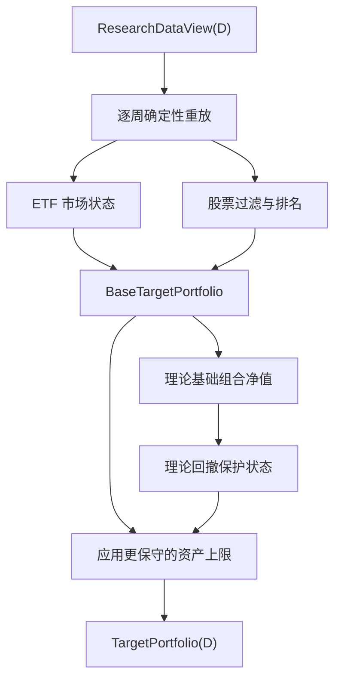
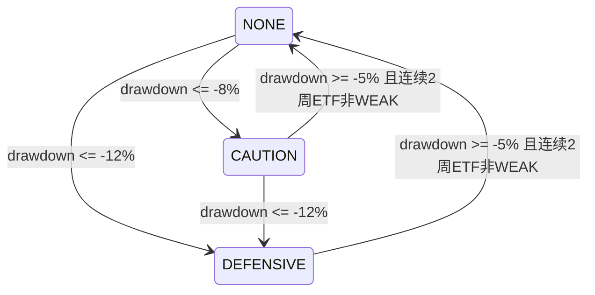

# 07 Strategy Core 与内置策略

## 1. 唯一策略实现

策略稳定标识为 `weekly_market_guard_rank_v1`。Backtest 和 Daily Run 都调用 [Strategy Protocol](01-shared-contracts.md#10-应用服务接口) 的同一个实现；不存在回测版和每日版分支。

Strategy 是纯计算：不进行 I/O，不读取系统时间、随机数、文件路径、上一目标 Artifact、模拟账户或真实账户。

## 2. StrategyDeclaration

| 项 | 值 |
|---|---|
| 决策频率 | 每周最后一个共同开放交易日收盘后 |
| 最早执行 | 下一交易日 |
| 最大研究回看 | 320 个交易日；最近 252 日用于正式状态重放，之前 68 日只用于因子预热 |
| 支持资产 | 普通 A 股、指定沪深300ETF、现金 |
| 用户因子 | 默认不依赖；可启用一个正式自定义因子评分槽，见 06 §7 |
| 主要持有周期 | 2–8 周；硬风险和市场降仓可提前退出 |
| 证券排序最终键 | 综合分降序、`security_id` 升序 |

## 3. 参数 Schema 与默认值

| 参数 | 类型 | 默认 | 约束 |
|---|---|---:|---|
| `csi300_etf_id` | string | 由运行配置显式给出 | 必须是白名单 CSI300_ETF |
| `entry_rank` | int | 20 | 10–50 |
| `exit_rank` | int | 40 | 必须大于 entry_rank |
| `min_holding_weeks` | int | 2 | 1–4 |
| `max_holding_weeks` | int | 8 | 4–12 |
| `min_listing_trade_days` | int | 252 | 不低于 252 |
| `min_size_percentile` | decimal | 0.20 | 0–0.50 |
| `min_amount_percentile` | decimal | 0.20 | 0–0.50 |
| `strong_stock_count` | int | 20 | 15–25 |
| `neutral_stock_count` | int | 10 | 8–13 |
| `single_stock_min_weight` | decimal | 0.03 | 0.01–0.05 |
| `single_stock_max_weight` | decimal | 0.05 | 0.03–0.05 |
| `caution_drawdown` | decimal | -0.08 | -0.05 至 -0.15 |
| `defensive_drawdown` | decimal | -0.12 | 必须小于 caution_drawdown |
| `recovery_drawdown` | decimal | -0.05 | 必须大于 caution_drawdown |
| `recovery_weeks` | int | 2 | 1–4 |
| `score_weights` | object | 见下文六项默认权重 | 必须包含全部六键，值非负且和为 1。 |
| `custom_factor_name` | string/null | null | 启用规则见 06 §7。 |
| `custom_factor_weight` | decimal | 0 | 未启用为 0；启用时 `(0,0.20]`。 |
| `custom_factor_direction` | string | `HIGHER_BETTER` | `HIGHER_BETTER` 或 `LOWER_BETTER`。 |
| `custom_factor_missing_policy` | string | `EXACT` | 内置策略固定 `EXACT`。 |

`score_weights` 六个精确键及默认值为：`momentum_60_ex5=0.35`、`momentum_40=0.20`、`trend_stability_60=0.15`、`volume_price_confirm_20=0.10`、`low_volatility_20=0.10`、`profitability=0.10`。修改任一权重必须显式提供完整集合且和为 1；算法只读取解析后的值，不再使用正文数字作为第二套常量。启用自定义因子时按 [06 §7](06-research-access.md#7-正式自定义因子策略路径) 缩放六项权重。

## 4. 确定性历史重放

持有期和回撤保护需要历史状态，但 Strategy 不读取外部上一目标。每次 `generate_target(D)` 都在 ResearchDataView 内确定性重放：

1. 从 D 向前取得最多 320 个交易日，其中最近 252 日用于正式状态重放，之前最多 68 日只用于因子预热；
2. 找出其中所有周决策日 H，对每个 H 取得 `ResearchDataView.slice(H)`；
3. 从最早具备完整 61 日因子窗口的决策日开始，以空基础组合为种子；
4. 逐周生成 `BaseTargetPortfolio`，维护理论持有周数；
5. 用基础目标权重和研究价格计算无费用、无成交限制的理论基础净值；
6. 从理论净值产生回撤保护状态；
7. 只返回 D 日应用保护后的正式 `TargetPortfolio`。

最大持有记忆不超过解析后的 `max_holding_weeks`，风险恢复观察不超过 `recovery_weeks`。若总历史不足 313 个交易日，则无法同时提供 252 日正式重放和最早正式日所需的 61 日因子窗口，运行必须失败并给出 `STRATEGY_WARMUP_INSUFFICIENT`；超过 320 日的数据不参与本次结果。



## 5. ETF 市场状态

令 `C` 为 D 日 ETF 研究收盘价，`MA20`、`MA60`、`Slope60`、`DD60`、`Vol20` 取自系统因子。

`STRONG` 需同时满足：

- `C > MA20 > MA60`；
- `Slope60 > 0`；
- `DD60 > -0.08`；
- `Vol20 < 0.35`。

`WEAK` 满足任一：

- `C < MA60` 且 `MA20 < MA60` 且 `Slope60 <= 0`；
- `DD60 <= -0.12`；
- `Vol20 >= 0.40` 且 `C < MA20`。

其余为 `NEUTRAL`。边界比较严格按上述 `>`、`<`、`<=`、`>=`，不做浮点模糊判断。

基础资产预算：

| 状态 | 个股 | ETF | 现金 | 目标个股数 |
|---|---:|---:|---:|---:|
| STRONG | 0.75 | 0.15 | 0.10 | 20 |
| NEUTRAL | 0.40 | 0.30 | 0.30 | 10 |
| WEAK | 0.00 | 0.10 | 0.90 | 0 |

## 6. 个股硬过滤

D 日候选必须全部满足：

1. `asset_type=A_SHARE` 且 D 日上市；
2. 非 ST，上市交易日数不少于 `min_listing_trade_days`；
3. `total_mv_pct_v1 >= min_size_percentile`；
4. `amount_20d_pct_v1 >= min_amount_percentile`；
5. `profit_positive_ttm_v1=true` 且 `consecutive_loss_2_v1=false`；
6. D 日非全天停牌、非一字涨停、非一字跌停；
7. 必需评分因子完整且有限；
8. `risk_flags` 不包含 05 §5 定义的 Strategy 禁止项。

单证券财务缺失时该证券排除并 WARNING；覆盖阈值不足时由就绪检查使整个运行失败。

## 7. 综合评分

在硬过滤后的截面内，每个连续因子先按当日 1%/99% 分位缩尾，再转换为 `[0,1]` 百分位。低波动项使用 `1 - percentile(volatility_20_v1)`。

```text
base_score = score_weights.momentum_60_ex5 × pct(momentum_60_ex5_v1)
           + score_weights.momentum_40 × pct(momentum_40_v1)
           + score_weights.trend_stability_60 × pct(trend_stability_60_v1)
           + score_weights.volume_price_confirm_20 × pct(volume_price_confirm_20_v1)
           + score_weights.low_volatility_20 × (1 - pct(volatility_20_v1))
           + score_weights.profitability × pct(roe_annualized_v1)

score = (1 - custom_factor_weight) × base_score
      + custom_factor_weight × directed_custom_factor_percentile
```

自定义因子未启用时 `custom_factor_weight=0`，第二项严格为 0 且不得读取用户文件。缩尾、百分位和同分规则以 [05 §4](05-research-data-and-factors.md#4-确定性数值算法) 为准。最终按完整精度 score 降序、`security_id ASC` 排序；展示得分为内部值乘 100，采用 ROUND_HALF_EVEN 保留 4 位小数，展示值不参与排序。

## 8. 进入、保留与退出

按以下顺序更新基础持仓：

1. 硬过滤失败立即退出，不受最短持有期保护；
2. 市场进入更低个股预算时，可为风险控制提前退出最低排名持仓；
3. 正常环境下，持有未满 `min_holding_weeks` 且仍通过硬过滤的股票保留；
4. 持有从 `min_holding_weeks` 到未满 `max_holding_weeks` 的股票，排名不大于 `exit_rank` 时保留；
5. 持有达到 `max_holding_weeks` 后，只有排名不大于 `entry_rank` 才能继续持有；
6. 按当前排名从高到低补充新股票，新进入者排名必须不大于 `entry_rank`；
7. 若保留数量超过状态目标数，风险预算优先，按排名从后向前退出到目标数。

STRONG 使用 `strong_stock_count`，NEUTRAL 使用 `neutral_stock_count`，WEAK 不持有个股；20 和 10 只是默认值。

## 9. 权重与不足股票池

个股预算在入选股票间等权：

```text
raw_weight = stock_budget / selected_count
target_weight = min(raw_weight, single_stock_max_weight)
```

默认目标数下单股为 3.75% 或 4%。若可选股票不足导致单股超过 `single_stock_max_weight`，按该参数封顶，剩余预算转现金；不得提高其他股票或 ETF 来掩盖不足。若计算权重低于 `single_stock_min_weight`，风险降仓优先于最低权重，最低权重只作为 WARNING 展示，不反向扩大风险预算。

## 10. 理论基础组合回撤

理论基础净值只使用 `BaseTargetPortfolio`：

- 决策日后的下一交易日起按上一基础权重计算日收益；
- 使用研究收盘到研究收盘收益；
- 忽略费用、滑点、停牌和真实成交；
- 权重之间未分配部分视为现金，现金收益为 0；
- 目的仅是生成确定性风险信号，不等同正式回测净值。

确切记账方式：D 日收盘后生成的 BaseTarget 在 D 日收盘价格上无费用再平衡，该目标权重应用于 D 收盘至下一交易日收盘的收益；随后持有份额不变，权重随价格自然漂移，直至下一个周决策日收盘完成旧组合当日收益后，再无费用再平衡到新 BaseTarget。不存在每日恢复目标权重。

理论回撤采用已批准的滚动 60 个交易日口径：`NAV(D) / max(NAV[t], t ∈ 最近最多60个正式重放交易日且 t<=D) - 1`。正式重放最初不足 60 个估值点时使用从正式重放起点到 D 的全部可用点；不得用预热区间构造理论净值。输出同时记录 `drawdown_window_trade_days=60` 和实际使用的 `drawdown_observations`。

保护状态机：



同一日期同时满足多个条件时，先执行更防御的转移。

资产上限：

- `CAUTION`：个股不超过 40%，ETF 不超过 20%，其余为现金；
- `DEFENSIVE`：个股 0%，ETF 10%，现金 90%；
- 最终资产配置取市场状态和回撤保护中更保守者，削减部分全部转现金。

## 11. 解释信息

组合级解释码至少包含 `REGIME_STRONG/NEUTRAL/WEAK`、`DRAWDOWN_NONE/CAUTION/DEFENSIVE` 和触发指标。证券级解释包含排名、六个系统评分分项、可选自定义因子分项、硬过滤结果、持有周数和进入/保留原因。

目标变化 `NEW/RETAIN/EXIT` 不由 Strategy 推断；由 [组合注释器](08-portfolio-and-rebalance.md#3-目标变化注释) 使用显式上一目标填写。

## 12. 测试要点

- Backtest 和 Daily Run 对同一 D、同一输入产生字节级等价的未注释 TargetPortfolio。
- 修改 D+1 数据、实际成交或 AccountSnapshot 不改变 D 日目标。
- 320 日输入中仅前 68 日用于因子预热、后 252 日用于正式状态重放；少于 313 日必须失败；不同输入摘要不共享缓存。
- 手算覆盖滚动窗口第 59、60、61 个估值点及旧峰值滚出窗口的边界。
- 各市场状态边界、排名同分、最短/最长持有期和风险提前退出均有黄金样例。
- 理论回撤只随基础目标和研究收益变化，不随回测费用或未成交变化。
- 历史每个决策日都使用对应 Slice；后来公告的修订和 D 日状态不能改变 H 日重放结果。
- 自定义因子关闭时与原六因子结果完全一致，开启时真实改变评分且全期覆盖/限制进入 Manifest。
