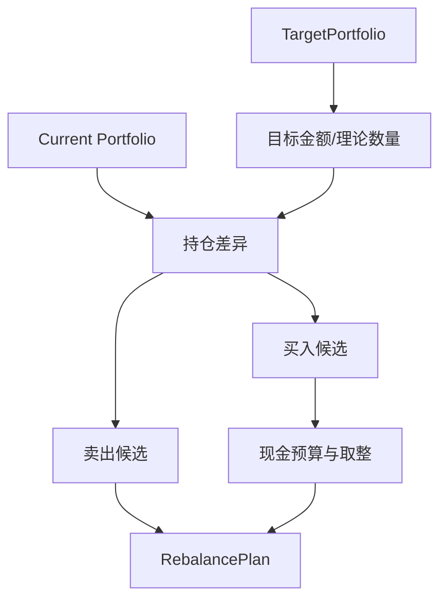

# 08 组合领域与调仓规划

## 1. 职责边界

组合领域负责 TargetPortfolio 合法性、目标变化注释、理论目标数量和调仓差异。它使用调用方显式提供的估值时点、总资产、参考价格和费用估算器；不自行读取行情，不判断市场能否成交，也不修改 Strategy 目标。

## 2. TargetPortfolioValidator

验证顺序：

1. Schema 和枚举；
2. 证券唯一且资产受支持；
3. 非负、有限权重；
4. 非现金加现金权重等于 1；
5. 普通 A 股单股权重上限；
6. ETF 标识与白名单一致；
7. `effective_from` 是 `decision_date` 后第一个交易日；
8. 解释字段完整。

失败产生 `PORTFOLIO_INVALID_TARGET`，不得“归一化修复”非法目标。

## 3. 目标变化注释

输入为当前目标和显式 Previous TargetPortfolio：

- 未提供上一目标：当前非现金目标标记 `INITIAL`，不宣称 NEW；
- 当前有、上一目标无：`NEW`；
- 两者都有且权重差绝对值不超过 `1e-10`：`RETAIN`；
- 当前权重大/小：`INCREASE` / `DECREASE`；
- 上一目标有、当前无：产生独立 EXIT 记录。

BacktestEngine 在自己的历史推进中传入上一期目标；Daily Run 只接受用户显式路径，不自动搜索 latest。

## 4. 理论目标金额和数量

对可获得组合总资产 `V` 和参考价格 `P_i`：

```text
target_amount_i = V × target_weight_i
raw_target_qty_i = target_amount_i / P_i
buy_rounded_qty_i = floor(raw_target_qty_i / buy_lot_size_i) × buy_lot_size_i
```

舍入只影响 RebalancePlan，不反向修改 TargetPortfolio。数量取整后的剩余资金留作现金，并记录 Issue `PORTFOLIO_LOT_ROUNDING_RESIDUAL`；Instruction 的对应 reason code 为 `LOT_ROUNDING_RESIDUAL`，两者属于明确分开的命名空间。

若没有可靠 `V` 或 `P_i`，相关金额/数量为 null，并由上层产生字段级限制。

## 5. 卖出数量

- 全部退出时，允许卖出当前全部可卖数量，包括不足常规交易单位的零股；
- 部分减仓时，卖出数量向下取 `sell_lot_size` 的整数倍；
- 回测中可卖数量来自 SimulatedAccount；Daily Advice 来自用户快照，未知时不得猜测；
- 请求数量不得超过持有数量或已知可卖数量。

## 6. RebalancePlanner



Planner 输入固定为：`target`、`current_positions`、`sellable_quantities`、`portfolio_value V`、`reference_prices`、`reference_price_time`、`lot_rules`、`fee_estimator`、`cash_budget`。模式决定这些事实的来源：

- Backtest：在执行日 T 公司行为处理后取得 `ExecutionDataView(T)`，用 T 日未复权开盘价对现金和持仓做开盘前标记，得到 V；理论目标数量也使用同一 T 日开盘价。不得用 D 日收盘价、研究价格或滑点后价格计算目标数量；
- Daily Advice：V 为 AccountSnapshot 的 `managed_total_assets`，参考价格为 D 日未复权收盘价；
- 费用估算使用执行假设下对现金最不利的候选成交价和精确费用公式。实际执行记录仍由 ExecutionSimulator 产生。

卖出优先级：EXIT → DECREASE，随后按相对超配比例降序、策略排名降序的反向顺序、`security_id ASC`。

买入优先级：

```text
relative_gap = max(target_amount - current_value, 0) / V
```

按 `relative_gap DESC`、策略排名 ASC、`security_id ASC`。先为每只证券计算不超过理论目标缺口的完整交易单位数，再按该优先级一次处理每只证券，分配 `min(缺口单位数, 当前现金可负担单位数)`，每次扣除估算成交金额和费用；不足一个单位时跳过。该算法复杂度与候选数线性相关，不按单个交易单位循环，且保证确定性和现金不为负。

Backtest 使用两阶段规划：先按 T 开盘事实产生并执行 SELL Instructions；将实际卖出净收入加入现金后，再使用同一个 V、同一组开盘参考价格和更新后持仓/现金产生 BUY Instructions。未成交卖出不进入第二阶段现金。Daily Advice 不执行第一阶段，因此买入预算永远只来自快照当前可用现金。

## 7. Backtest 与 Daily 的现金差异

- Backtest 严格按“两阶段规划”在卖出实际成交后使用到账现金安排买入；未成交卖出不会产生现金。
- Daily Advice 的确定性买入建议只使用 AccountSnapshot 当前 `available_cash`。
- Daily 可以展示“若卖出实际成交后仍需买入”的条件性差额，但 `suggested_quantity` 必须为空或仅包含当前现金支持部分。

## 8. 非目标

RebalancePlanner 不处理：

- 停牌、涨跌停和实际成交价；
- 费用最终结算；
- 公司行为；
- 订单生命周期或券商委托；
- 目标权重优化。

这些分别属于执行模拟或产品范围外能力。

## 9. 测试要点

- 随机合法目标均满足数量非负、现金预算不透支和稳定排序。
- 目标非法时不得自动归一化。
- 全部退出零股、部分减仓取整、最低费用导致少买一手均有边界测试。
- 相同输入无论原集合顺序如何都产生相同 RebalancePlan。
- Daily 模式下增加理论卖出金额不得提高确定性买入数量。
- Backtest 的 D 日收盘、T 日开盘和滑点成交价不同的黄金样例必须证明目标数量只使用 T 日开盘价。
- 大资产、小价格场景的 Planner 运行次数只随候选证券数增长，不随可买交易单位数增长。
