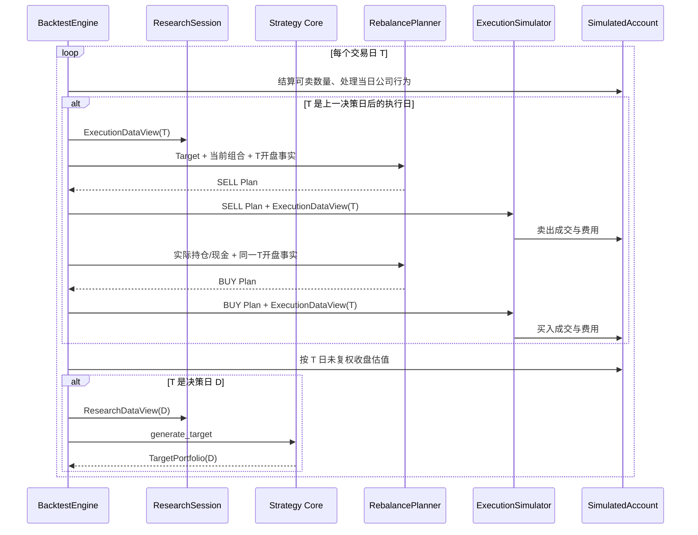

# 09 回测、执行与模拟账户

## 1. BacktestEngine

BacktestEngine 按共同交易日顺序推进，控制 Strategy、调仓、执行、公司行为、估值和记录。



决策发生在 D 日估值之后，目标只能进入下一交易日的执行队列。BacktestEngine 在自身时间线维护上一期 Target，仅用于变化注释，不传入 Strategy。调仓采用 [08 §6](08-portfolio-and-rebalance.md#6-rebalanceplanner) 的两阶段规划：T 日开盘价用于目标数量和开盘组合价值，实际卖出完成后才规划买入。

## 2. 初始化与日期范围

运行参数：`initial_cash`（默认 1,000,000 CNY，必须大于 0）、`start_date`、`end_date`、策略和执行假设。

- 正式指标区间从 `start_date` 开始；其前必须可取得至少 313、至多使用 320 个交易日的研究输入，用于生成区间首个可执行目标，预热区间不进入正式绩效指标。
- `start_date` 前不得存在模拟持仓或交易。
- 第一个可执行目标由区间内第一个合格周决策日产生。
- 区间结束日必须完成公司行为、执行和收盘估值后结束。

## 3. ExecutionDataView 与成交资格

每个请求交易在 T 日按以下顺序判断：

1. T 为开放交易日；
2. 证券仍上市且有可解释的真实行情；
3. 非全天停牌；
4. BUY 时非一字涨停，SELL 时非一字跌停；
5. 有有效开盘价、最高/最低价和涨跌停价；
6. 请求数量满足持仓、可卖数量和交易单位；
7. 成交量参与率允许至少一个交易单位。

前四类无法成交是正常业务结果，记录 `UNFILLED` 及原因；无法可靠估值或数据互相冲突会使 Backtest FAILED。

## 4. 成交价格与容量

默认 `price_model=NEXT_OPEN`，`slippage_bps=10`，`max_volume_participation=0.10`。

```text
BUY candidate  = open_raw × (1 + slippage_bps / 10000)
SELL candidate = open_raw × (1 - slippage_bps / 10000)

BUY price  = min(max(candidate, open_raw), high_raw, up_limit)
SELL price = max(min(candidate, open_raw), low_raw, down_limit)
```

全部计算使用 Decimal。价格先按证券价格最小变动单位采用 ROUND_HALF_UP 四舍五入，再按 `[low_raw, high_raw]` 和涨跌停范围重新夹取；若夹取边界不是有效 tick，BUY 向下、SELL 向上取到范围内最近 tick，仍不存在合法价格则 `NO_EXECUTION_PRICE`。

最大成交数量为 `floor(volume_shares × max_volume_participation / lot_size) × lot_size`；`volume_shares` 已在 Research 中由供应商“手”转换为股/份。全量退出零股不受常规 lot_size 截断，但仍受可卖数量和容量限制。日线模型允许部分成交，剩余数量记录 `VOLUME_CAP`，不会自动滚动成隐藏订单。

## 5. 订单顺序与现金

- 先生成并按确定性优先级处理全部卖出；卖出阶段结束后依据实际账户状态生成买入计划。
- 已成交卖出所得扣除费用后立即增加模拟可用现金，可用于同日后续买入。
- 未成交卖出不产生现金。
- 每笔买入在成交前重新检查“成交金额 + 预计费用 <= 当前现金”；不足时减少到可负担交易单位，仍不足则 `CASH_INSUFFICIENT`。
- 不允许负现金或融资融券。

## 6. 费用模型

费用表带 `effective_from`，每次运行把最终费率写入 Manifest。默认 `cn_cash_market_default_v1` 是研究假设，用户必须在结果中看到并可覆盖经纪商佣金。

### 6.1 公式

```text
commission = 0                                              # gross_amount = 0
commission = max(gross_amount × commission_rate, minimum_commission)  # gross_amount > 0
transfer_fee = gross_amount × transfer_fee_rate
stamp_duty = gross_amount × stamp_duty_sell_rate   # 仅 A 股 SELL
total_fee = round_fen(commission + transfer_fee + stamp_duty)
```

每个分项先以 Decimal 保留完整精度，`commission + transfer_fee + stamp_duty` 的合计采用 ROUND_HALF_UP 一次取到人民币分；为保证分项和等于合计，commission 和 transfer_fee 各自向分取整，最后将差额归入 stamp_duty（无印花税时归入 commission）。默认值：

| 资产/时期 | 佣金（双向） | 最低佣金 | 过户费（双向） | 卖出印花税 |
|---|---:|---:|---:|---:|
| A 股，2023-08-28 起 | 0.0003 | 5 CNY | 0.00001 | 0.0005 |
| A 股，2022-04-29 至 2023-08-27 | 0.0003 | 5 CNY | 0.00001 | 0.0010 |
| A 股，2008-09-19 至 2022-04-28 | 0.0003 | 5 CNY | 0.00002 | 0.0010 |
| 沪深300ETF | 0.0003 | 5 CNY | 0 | 0 |

官方公开口径支持将现行 A 股卖出印花税建模为成交金额 0.5‰，并将 A 股交易过户费建模为成交金额 0.01‰ 双向收取；佣金和最低佣金是保守研究默认值，不代表用户券商实际费率：

- [上海证券交易所股票投资费用说明](https://one.sse.com.cn/onething/gptz/)
- [中国结算上海市场收费表](https://www.chinaclear.cn/zdjs/fbzyls/202506/9d22b74d9f2e40edb67b44d1f6596f18/files/%E4%B8%8A%E6%B5%B7%E5%B8%82%E5%9C%BA%E8%AF%81%E5%88%B8%E7%99%BB%E8%AE%B0%E7%BB%93%E7%AE%97%E4%B8%9A%E5%8A%A1%E6%94%B6%E8%B4%B9%E5%8F%8A%E4%BB%A3%E6%94%B6%E7%A8%8E%E8%B4%B9%E4%B8%80%E8%A7%88%E8%A1%A8.pdf)

早于默认表覆盖日期的回测必须显式提供完整费用表，否则配置失败。

## 7. SimulatedAccount

状态包括：`cash_available`、`cash_receivable`、`positions`、`sellable_quantities`、`pending_settlements`、`dividend_entitlements`、`equity`、`ledger`。

允许改变账户的事件：

- `CASH_INITIALIZED`；
- `TRADE_FILLED`；
- `FEE_CHARGED`；
- `CASH_DIVIDEND_DECLARED/PAID`；
- `STOCK_DISTRIBUTION_APPLIED`；
- `SPLIT_APPLIED`；
- `SELLABLE_RELEASED`；
- `VALUATION_RECORDED`。

买入股票在下一个交易日才进入可卖数量；卖出所得可用于当日买入，但真实提款结算不在研究范围内。

## 8. 公司行为顺序

默认 `dividend_tax_model=PROVIDER_AFTER_TAX`：现金股利使用 Tushare `cash_div`；结果固定提示该值不等同用户按实际持有期承担的最终个税。用户可显式选择 `FLAT_RATE` 并提供 `dividend_tax_rate`（`[0,1]`），此时使用 `cash_div_tax × (1-rate)`。所需字段缺失时，持有该证券的回测失败，不在两种模型间自动回退。

每日固定顺序：

1. 释放到期可卖数量；
2. 对上一共同交易日收盘登记的持仓固化当日现金/送股权益；登记权益使用 record_date 收盘后的总持仓数量，不受后续交易影响；
3. ex_date 开盘前将现金权益计入 `cash_receivable`；将送股/转增数量加入总持仓但在 `stock_list_date` 前不可卖；
4. pay_date 开盘前将现金股利从应收转为可用现金；stock_list_date 开盘前释放新增股可卖数量；
5. 构造 T 日 ExecutionDataView，用未复权开盘价标记组合并执行卖出阶段；
6. 使用实际卖出净收入和更新后账户执行买入阶段；
7. 将成交和费用写入账户事件账本；
8. 使用未复权收盘价估值。

现金股利从 ex_date 至到账前计入权益但不计入可用现金。送股、转增和拆并股以登记权益的确定比例调整数量；计算结果必须为整数股，否则因未定义零股现金替代而失败。拆并股在 ex_date 同比例调整总数量和可卖数量。持仓遇到配股、要约、`OTHER` 或无法确定顺序的重大公司行为时，Backtest 失败并报告日期和证券，不以忽略方式生成完整收益。

## 9. 守恒断言

每个账户事件后检查：

```text
cash_after = cash_before + cash_in - cash_out - fees
quantity_after = quantity_before + bought + corporate_add - sold - corporate_remove
equity = cash_available + cash_receivable + Σ(quantity × valuation_price)
```

任何无事件来源的差异产生 `BACKTEST_ACCOUNT_CONSERVATION_BROKEN` 并终止运行。

## 10. 估值缺失

- 全天停牌且存在可靠停牌事实时，可使用最近一个交易日未复权收盘价估值并产生 WARNING。
- 非停牌证券缺少 T 日估值价、价格非正或公司行为后无法衔接时，Backtest FAILED。
- 退市后无可靠处置或估值规则且仍持仓时，Backtest FAILED，不按零值默默核销。

## 11. 测试要点

- D 日目标绝不在 D 日成交。
- 一字涨停买入、一字跌停卖出、停牌、成交量上限和现金不足分别生成正确未成交。
- 买入 T+1 可卖、卖出资金同日可买的时间顺序有事件级测试。
- 费用生效日期、最低佣金、ETF 无印花税和分级费率边界有黄金测试。
- 随机交易/公司行为序列始终满足账户守恒；人为删除一个事件必须失败。
- 两阶段规划必须证明未成交卖出不增加买入预算，部分成交只增加实际净收入。
- 现金股利两种税模型、record/ex/pay 三日期、送股上市可卖日期和非整数送股分别有事件级黄金测试。
