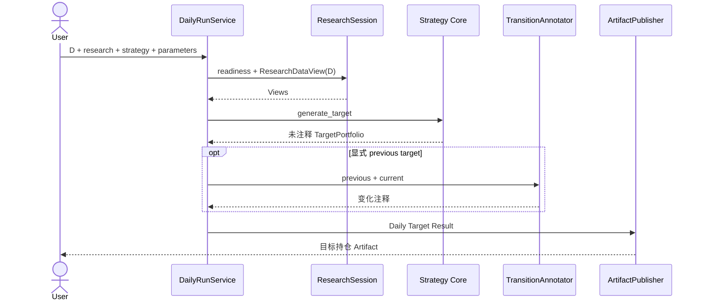

# 11 每日运行与交易建议

## 1. Daily Target

`daily target` 在 D 日收盘后运行：



只要研究和策略输入完整，即使没有账户信息也必须正常产生 TargetPortfolio。目标有效期从 D 后第一个交易日开始，不预测该日能否成交。

## 2. AccountSnapshot 文件

UTF-8 JSON：

```json
{
  "schema_version": "1.0",
  "as_of": "2026-08-08T18:00:00+08:00",
  "currency": "CNY",
  "account_scope": "STRATEGY_MANAGED",
  "scope_completeness": "COMPLETE",
  "positions_completeness": "COMPLETE",
  "available_cash": 125000.00,
  "managed_total_assets": 1000000.00,
  "excluded_asset_value": 250000.00,
  "source_note": "依据券商App手工导出",
  "positions": [
    {
      "security_id": "600000.SH",
      "quantity": 5000,
      "sellable_quantity": 5000,
      "market_value": 52000.00,
      "reference_price": 10.40,
      "reference_price_date": "2026-08-07"
    }
  ]
}
```

字段语义以 [共享合同](01-shared-contracts.md#6-accountsnapshot) 为准。物理规则：

- `schema_version` 必填；未知 Major 拒绝。
- positions 中证券唯一，数量非负整数。
- `sellable_quantity <= quantity`；未知必须为 null 或省略。
- `as_of` 不能晚于运行开始时刻，过旧快照产生 WARNING；默认超过 3 个自然日视为过旧。
- `positions_completeness=COMPLETE` 且列表为空表示确认空仓；`UNKNOWN` 必须使用空列表；`PARTIAL` 不允许把未列证券推断为零持仓。
- `account_scope` 固定为 `STRATEGY_MANAGED`；`excluded_asset_value` 只作提示，不加入任何目标金额或现金预算。
- 系统不将本文件更新、对账或保存为影子账户。

## 3. 账户资产确定

仅使用用户明确提供的 `managed_total_assets`。当 `scope_completeness=COMPLETE`、`positions_completeness=COMPLETE`，且 `available_cash` 和每项 `market_value` 完整时，缺失的管理总资产可以派生为 `derived_managed_total_assets` 并标注派生。若提供值与可完整派生值的差异超过 `max(1 CNY, managed_total_assets × 0.1%)`，产生 `ADVICE_ACCOUNT_VALUE_CONFLICT`；用户提供值仍作为目标金额基数，但全部数量携带冲突限制。

`scope_completeness` 非 `COMPLETE` 时，`managed_total_assets` 必须为空且不得派生；系统仍可展示目标权重和已知账户事实，但不能生成全组合确定性数量。账户中产品支持范围外的资产不由系统建议交易，其价值只能放入 `excluded_asset_value`，不得包含在策略管理总资产中。

## 4. 参考价格

- 优先使用 Research Artifact 中 D 日未复权收盘价；
- AccountSnapshot 价格只用于当前市值交叉检查，不覆盖 D 日参考价格；
- 参考价格必须携带 `reference_price_date=D`；
- 缺少个别证券价格时该证券金额和数量为 null，其他证券继续处理；
- 参考价格不是 D+1 预测价或真实成交价。

## 5. TradeAdvice 计算

对每只当前或目标证券形成一个 [TradeAdviceItem](01-shared-contracts.md#7-rebalanceplanexecution-与-tradeadvice)：

1. 有账户总资产和参考价格时计算目标金额和理论目标数量；
2. 有当前数量时计算理论差异；
3. 减仓时只有 `sellable_quantity` 已知才计算确认可卖数量；
4. 买入时只用快照中的当前 `available_cash` 计算确定性建议数量；
5. 预期卖出所得不加入当前现金；
6. 交易单位、单股权重和现金保留规则与 RebalancePlanner 相同；
7. 未解决差异单独输出，不把它伪装成建议已完成。

动作映射：当前无目标且持有为 SELL；目标高于当前为 BUY/INCREASE；目标低于当前为 DECREASE/SELL；在数量容差内为 HOLD；事实不足为 UNRESOLVED。

## 6. 字段级降级矩阵

| 缺失事实 | 仍可输出 | 必须为空或禁止输出 |
|---|---|---|
| 整个 AccountSnapshot | TargetPortfolio、目标权重、策略原因 | 当前数量、金额和具体买卖数量 |
| `managed_total_assets` 且无法派生 | 目标权重、已知持仓方向 | 目标金额、理论目标数量、买入数量 |
| `available_cash` | 目标、卖出方向、已知减仓数量 | 确定性买入数量 |
| `positions_completeness=UNKNOWN` | 目标组合、账户总额（若范围完整） | 全部增减仓差异和交易数量 |
| `positions_completeness=PARTIAL` | 目标组合、列表内证券的已知事实 | 未列证券的差异和买入数量；不得把未列证券当作零持仓 |
| `scope_completeness!=COMPLETE` | 目标组合、已知账户事实 | 全组合目标金额和确定性买入数量 |
| `sellable_quantity` | 理论减仓方向与目标差异 | 可执行卖出数量 |
| 个别参考价格 | 其他证券完整建议、该证券方向 | 该证券金额和数量 |

所有空字段必须在该 Item 的 `limitations` 中包含稳定原因码。

## 7. 当前现金支持的买入

先为目标现金保留：

```text
reserved_cash = managed_total_assets × target.cash_weight
spendable_cash = max(available_cash - reserved_cash, 0)
```

按相对目标缺口从大到小分配交易单位和预计费用。若当前现金低于目标现金，所有买入确定数量为 0，但仍展示理论缺口。预计费用只用于防止建议超出当前现金，实际费用以券商为准。

## 8. 结果表达

报告必须分开显示：

1. 策略目标持仓；
2. 当前账户事实及其时点；
3. 当前事实支持的确定性参考建议；
4. 条件性或未解决差异；
5. 参考价格日期、账户缺失和“仅供参考、非订单”的声明。

“正常运行且无需调整”要求 Strategy 成功、账户事实足够且全部差异在交易单位容差内；不能与输入不足或运行失败混淆。

## 9. 测试要点

- 无账户仍发布完整目标，不发布伪具体数量。
- 缺现金、持仓、可卖数量和个别价格分别验证降级矩阵。
- 已确认空仓、持仓未知和部分持仓必须产生三个不同结果；未知和部分持仓绝不能触发假定零持仓的买入。
- 增加预期卖出金额不改变确定性买入数量。
- 账户总资产冲突、过期快照和范围外证券有明确 Warning。
- 报告中的目标、当前事实和建议三层不能交换或覆盖。
