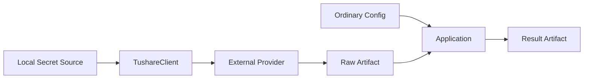

# 13 安全、日志与本地运行

## 1. 信任边界

秘密只存在于 Local Secret Source 和真正发送外部请求的客户端边界。Research、Strategy、Backtest、Daily、Result 和报告均不接收秘密参数。

## 2. 凭证

- MVP 从环境变量 `TUSHARE_TOKEN` 读取 token；普通 TOML 不允许 `token`、`secret`、`password` 等字段。
- token 不写入请求 Manifest、缓存、异常、日志、Result 或 Failure Diagnostic。
- 客户端不得把带认证内容的完整请求对象交给通用日志器。
- 缺少 token 时只产生 `SECURITY_SECRET_MISSING`，不回显变量内容。

## 3. 脱敏

在日志和错误出口统一执行：

- 键名匹配 `token|secret|password|credential|authorization` 的值替换为 `<redacted>`；
- 已加载秘密的完整值及长度不少于 8 的连续片段不得出现；
- URL query、HTTP header 和供应商原始错误先结构化提取再输出；
- 普通终端不显示内部堆栈，本地诊断日志中的堆栈也经过脱敏。

发布器在写入前扫描 JSON、Markdown 和日志文本；发现已知秘密片段时阻止发布并产生 `SECURITY_SECRET_EXPOSURE_BLOCKED`。

## 4. 文件和路径

- 所有输入输出先解析绝对路径，再校验位于用户明确选择的工作范围；
- 拒绝输出到文件系统根、工作区根覆盖和通过符号链接逃逸；
- 临时目录与正式输出位于同一父目录，并采用仅当前用户可访问的最佳可用权限；
- 不修改用户输入文件，包括 PRD、总体架构、用户因子和 AccountSnapshot；
- 对显式覆盖先构建新完整产物，不原地截断旧文件。

## 5. 日志

日志为 UTF-8 JSON Lines，字段：`timestamp`、`level`、`run_id`、`stage`、`event`、`message`、`context`。

规则：

- `INFO` 记录阶段、范围、行数和耗时；
- `WARNING/ERROR` 引用 Issue code；
- 不记录完整数据行、持仓明细或账户金额，除非调试模式且仍经过脱敏；
- 影响结论的重要事实必须进入正式 Issue/Result，不能只在日志；
- 日志文件路径由用户显式指定或仅输出终端，不自动建立全局历史日志库。

## 6. 网络和进程

- 只有 `data fetch` 允许外部网络访问；其他业务命令在网络被禁用时仍应工作。
- 不启动守护进程、后台服务、HTTP 监听或自动调度。
- 单进程内可以使用 DuckDB 的内部并行执行，但结果排序和聚合必须确定性。
- 对内存不足、磁盘不足和用户中断，安全清理临时输出并保留旧正式 Artifact。

## 7. 本地资源预算

运行前估算输入大小和可用磁盘；默认要求临时空间不少于预计输出的 2 倍。DuckDB 内存、线程和临时目录的精确默认值由 [17 Python 工程与运行基线](17-engineering-baseline.md) 唯一定义。资源不足产生明确 ERROR，不通过悄悄缩小日期或证券范围继续。

## 8. 威胁与控制

| 风险 | 控制 |
|---|---|
| token 泄漏 | 最小传递、统一脱敏、发布前扫描 |
| 恶意路径或覆盖 | 绝对路径校验、已有默认报错、原子发布 |
| 损坏输入 | Manifest/摘要/Schema 校验 |
| CSV 公式注入 | CSV 人类输出中以 `= + - @` 开头的文本加安全前缀；结构化值不变 |
| 未来信息泄漏 | View 强制可见性和时间反事实测试 |
| 真实账户误推演 | 每次显式 AccountSnapshot，不保存影子账户 |
| 报告被误认为订单 | 固定非订单声明和 Target/Advice 分层 |

## 9. 测试要点

- 用金丝雀 token 执行所有成功/失败路径，扫描工作区和捕获输出均不得出现。
- 非 fetch 命令断网运行通过。
- 路径遍历、根路径、符号链接逃逸和已有输出均被拒绝。
- 用户中断、磁盘写满和摘要失败不留下半成品正式目录。
- AccountSnapshot 原文不会被复制到 Result。
