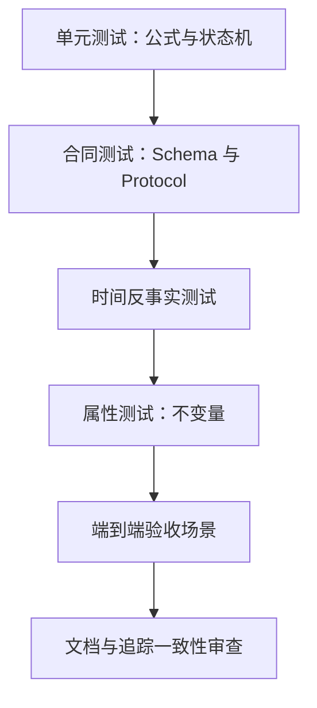

# 14 测试与需求追踪

## 1. 测试分层

| 层级 | 证明内容 |
|---|---|
| 单元测试 | 因子、评分、费用、取整、回撤、指标和状态转移公式；期望值以 18 的手算向量为准。 |
| 合同测试 | JSON/CSV/Parquet Schema、枚举、Major 版本和模块 Protocol。 |
| 时间测试 | `available_from`、D/D+1、财务公告、未来数据扰动。 |
| 属性测试 | 权重、现金、账户守恒、确定性、原子发布。 |
| E2E | PRD 完整用户流程和可靠降级。 |
| 文档审查 | 链接、Mermaid、重复定义、上位文件摘要和追踪覆盖。 |

## 2. 固定测试数据集

| Fixture | 内容 |
|---|---|
| `FX-BASE-600` | 600 只合成 A 股、1 只 CSI300ETF、沪深300指数、400 个交易日、完整财务和状态，用于策略与截面百分位。 |
| `FX-TEMPORAL` | 同一报告期初次披露、后续修订及 D+1 未来行情，用于可见性反事实。 |
| `FX-EXECUTION` | 停牌、一字涨跌停、部分成交、现金不足、零股和最低佣金。 |
| `FX-CORPORATE` | 现金分红、送股、拆股及一个不支持的配股事件。 |
| `FX-DAILY-DEGRADE` | 逐项覆盖管理范围未知、持仓 UNKNOWN/PARTIAL、现金未知、可卖数量未知、管理总资产未知和个别价格缺失。 |
| `FX-ARTIFACT` | 完整、摘要篡改、Schema Major 不兼容和中断发布的 Artifact。 |

合成行情使用固定种子；属性测试失败必须输出种子和最小反例。黄金文件包含结构化结果，不以 Markdown 文本作为算法正确性的唯一证据。

## 3. 六项架构不变量证明

| 不变量 | 正向证据 | 必须失败的反例 |
|---|---|---|
| 历史可见性 | `TT-VIS-001` 对 D 日 View 逐行断言 | 加入 D+1 行情和后来财务修订后 D 日目标发生变化 |
| 策略同源性 | `CT-STRAT-001` Backtest/Daily 注入同一实现；`E2E-PARITY-001` 目标相同 | 单独注册“daily strategy”或“backtest strategy” |
| 策略确定性 | `PT-DET-001` 打乱输入顺序、重复运行结果相同 | Strategy 访问时钟、随机数、账户或路径 |
| 模拟账户守恒 | `PT-ACCOUNT-001` 每事件前后验证守恒 | 删除费用或公司行为事件导致资产凭空变化 |
| 依赖局部性 | `CT-READY-001` 删除无关表仍 READY | 删除必需字段却继续运行，或无关权限阻断运行 |
| 真实账户隔离 | `E2E-ACCOUNT-001` 每次只消费显式快照 | 从上一建议推算当前持仓或保存影子账户 |

补充必须通过的边界证明：

- `TT-SLICE-001`：`ResearchDataView.slice(H)` 对行情、证券状态、系统因子和后来修订财务同时执行 `business_date<=H` 与 `available_from<=H`；任何一次越界都产生 `STRATEGY_HISTORY_SLICE_VIOLATION`。
- `UT-DRAWDOWN-ROLL60-001`：验证第 59、60、61 个估值点和旧峰值滚出窗口；预热区间不得进入理论净值或回撤窗口。
- `CT-SCHEMA-ROUNDTRIP-001`：16 中每个物理 Schema 均由真实生产者写出并由真实消费者读取，覆盖非法 null、未知 Major、排序和重复主键反例。
- `E2E-ACCOUNT-COMPLETENESS-001`：确认空仓、持仓 UNKNOWN、持仓 PARTIAL、管理范围不完整四种输入得到互不混淆的建议和 limitation。
- `E2E-CUSTOM-FACTOR-PATH-001`：关闭自定义因子时不读取文件；开启时影响得分，并在历史全部周决策日强制精确覆盖与责任声明。

## 4. 关键端到端场景

| 场景 | 步骤 | 通过条件 |
|---|---|---|
| `E2E-DATA-001` | fetch → check-raw → full build → check-research | Raw/Research 分离、覆盖和摘要完整 |
| `E2E-FACTOR-001` | 检查外部因子 → 使用因子策略运行 | Schema、覆盖、责任声明完整；原文件未复制 |
| `E2E-STRATEGY-001` | 同一 D 分别 Daily 与 Backtest 调用 | 未注释目标完全一致 |
| `E2E-BACKTEST-001` | 完整周频回测 | 时间顺序、交易限制、费用、基准、阶段指标完整 |
| `E2E-DAILY-001` | D 日目标 + 完整账户建议 | 目标、账户、Advice 三层分离，数量不超现金/可卖 |
| `E2E-DEGRADE-001` | 逐项删除账户事实 | 每种情况严格匹配降级矩阵 |
| `E2E-ARTIFACT-001` | 成功发布、已有路径、中断和覆盖 | 无半成品、无静默覆盖、摘要可验证 |
| `E2E-SECURITY-001` | 金丝雀 token 穿过成功/失败路径 | 工作区、输出和捕获日志均无 token |
| `E2E-OFFLINE-001` | 干净环境运行内置完整示例 | 不访问网络，产生可校验 Research、Backtest、Daily 三类正式 Artifact |
| `E2E-CAPABILITY-001` | 以显式真实开关执行最小接口探测 | 每个必需 Tushare 接口记录实际 AVAILABLE 或明确权限/Schema 失败，不以积分数代替探测 |

## 5. PRD 第 27 章逐项追踪矩阵

### 5.1 数据准备（PRD 27.1）

| ID | 验收要求 | 设计落点 | 验证 |
|---|---|---|---|
| PRD-27.1-01 | 从 Tushare 获取原始数据 | 04 §1–4 | E2E-DATA-001 |
| PRD-27.1-02 | Raw 与 Research 分别保存 | 03 §3–4 | CT-ART-001 |
| PRD-27.1-03 | 整理不改写 Raw | 03 §3；05 §1 | PT-RAW-IMMUTABLE-001 |
| PRD-27.1-04 | 从 Raw 生成策略可用 Research | 05 §1–6 | E2E-DATA-001 |
| PRD-27.1-05 | Strategy 不读取 Tushare 字段 | 06 §1–2；07 §1 | CT-BOUNDARY-001 |
| PRD-27.1-06 | Research 支持回测和每日运行 | 06 §2–4 | E2E-PARITY-001 |
| PRD-27.1-07 | 系统因子两种运行含义相同 | 05 §3；07 §1 | CT-FACTOR-SEMANTICS-001 |
| PRD-27.1-08 | 系统因子不使用决策日后信息 | 05 §2.5–3；06 §2 | TT-VIS-001 |

### 5.2 用户自定义因子（PRD 27.2）

| ID | 验收要求 | 设计落点 | 验证 |
|---|---|---|---|
| PRD-27.2-01 | 导入已计算历史因子 | 06 §5–7 | E2E-FACTOR-001 |
| PRD-27.2-02 | 识别名称、证券、日期和值 | 06 §5 | CT-FACTOR-SCHEMA-001 |
| PRD-27.2-03 | Strategy 可读取使用 | 01 §4；06 §6–7 | CT-CUSTOM-VIEW-001 |
| PRD-27.2-04 | 缺少必要覆盖时明确指出 | 06 §4、§6 | E2E-FACTOR-MISSING-001 |
| PRD-27.2-05 | 系统不重新计算用户因子 | 03 §5；06 §5 | CT-BOUNDARY-002 |
| PRD-27.2-06 | 不验证计算逻辑 | 06 §6–7 | DOC-LIMIT-001 |
| PRD-27.2-07 | 不验证历史可见性 | 06 §6–7；12 §2–3 | DOC-LIMIT-001 |
| PRD-27.2-08 | 正式结果提示用户责任 | 12 §5–7 | E2E-FACTOR-001 |
| PRD-27.2-09 | 用户因子不修改 Research | 03 §5；06 §5 | PT-RESEARCH-IMMUTABLE-001 |
| PRD-27.2-10 | 用户因子仅供 Strategy 使用 | 06 §5–7 | CT-BOUNDARY-003 |

### 5.3 内置策略（PRD 27.3）

| ID | 验收要求 | 设计落点 | 验证 |
|---|---|---|---|
| PRD-27.3-01 | 至少一个完整策略 | 07 全文 | E2E-STRATEGY-001 |
| PRD-27.3-02 | 用户可修改公开参数 | 07 §3；02 §3 | UT-PARAM-001 |
| PRD-27.3-03 | 每个 D 排除当时 ST | 07 §6 | TT-ST-001 |
| PRD-27.3-04 | 每个 D 排除上市不足一年 | 07 §3、§6 | TT-LISTING-001 |
| PRD-27.3-05 | 可以持有普通 A 股 | 07 §5、§8–9 | E2E-STRATEGY-001 |
| PRD-27.3-06 | 可以持有沪深300ETF | 07 §5、§10 | UT-ALLOCATION-001 |
| PRD-27.3-07 | 可以持有部分或全部现金 | 07 §5、§10 | UT-ALLOCATION-002 |

### 5.4 历史评估（PRD 27.4）

| ID | 验收要求 | 设计落点 | 验证 |
|---|---|---|---|
| PRD-27.4-01 | 选择策略和一组参数 | 02 §2.2–3 | E2E-BACKTEST-001 |
| PRD-27.4-02 | 按历史时间顺序运行 | 09 §1–2 | TT-SEQUENCE-001 |
| PRD-27.4-03 | Research 只含当时可见信息 | 05 §2.5；06 §2 | TT-VIS-001 |
| PRD-27.4-04 | ST 使用历史状态 | 05 §2.4；07 §6 | TT-ST-001 |
| PRD-27.4-05 | 上市时间按历史 D 计算 | 05 §2.4；07 §6 | TT-LISTING-001 |
| PRD-27.4-06 | 累计和年化收益 | 10 §2 | UT-METRIC-RETURN-001 |
| PRD-27.4-07 | 沪深300同期表现 | 10 §2 | UT-BENCHMARK-001 |
| PRD-27.4-08 | 最大回撤等风险指标 | 10 §3、§6 | UT-METRIC-RISK-001 |
| PRD-27.4-09 | 费用和无法成交 | 09 §3–6 | FX-EXECUTION + E2E-BACKTEST-001 |
| PRD-27.4-10 | 不同历史阶段结果 | 10 §7 | UT-PERIOD-001 |
| PRD-27.4-11 | 显示重大限制 | 12 §5–7 | E2E-BACKTEST-LIMIT-001 |
| PRD-27.4-12 | 相同条件业务结果一致 | 00 §7；07 §1 | PT-DET-001 |
| PRD-27.4-13 | 不自动比较参数结果 | 02 §2.2；10 范围 | CT-NON-GOAL-001 |

### 5.5 目标持仓（PRD 27.5）

| ID | 验收要求 | 设计落点 | 验证 |
|---|---|---|---|
| PRD-27.5-01 | D 日收盘后运行 | 00 §2；11 §1 | TT-DAILY-CUTOFF-001 |
| PRD-27.5-02 | A股、ETF、现金完整组合 | 01 §5；07 §5、§9 | UT-TARGET-001 |
| PRD-27.5-03 | 不新增 D 日 ST 股票 | 07 §6 | TT-ST-001 |
| PRD-27.5-04 | 不新增上市不足一年股票 | 07 §6 | TT-LISTING-001 |
| PRD-27.5-05 | 包含证券、权重和原因 | 01 §5；07 §11 | CT-TARGET-SCHEMA-001 |
| PRD-27.5-06 | 无需调整有明确结果 | 11 §8 | E2E-NO-CHANGE-001 |
| PRD-27.5-07 | 无账户仍生成目标 | 11 §1、§6 | E2E-DEGRADE-001 |

### 5.6 具体买卖建议（PRD 27.6）

| ID | 验收要求 | 设计落点 | 验证 |
|---|---|---|---|
| PRD-27.6-01 | 依据现金持仓产生动作 | 11 §3–5 | E2E-DAILY-001 |
| PRD-27.6-02 | 金额、数量、价格和日期 | 01 §7；11 §4–5 | CT-ADVICE-SCHEMA-001 |
| PRD-27.6-03 | 考虑单位、现金和可卖数量 | 08 §4–7；11 §5–7 | PT-ADVICE-BUDGET-001 |
| PRD-27.6-04 | 缺关键事实不输出伪精度 | 11 §6 | E2E-DEGRADE-001 |
| PRD-27.6-05 | 个别缺失不影响其他证券 | 11 §4、§6 | E2E-PRICE-MISSING-001 |
| PRD-27.6-06 | 明确建议仅供参考 | 11 §8；12 §5.2 | DOC-DISCLAIMER-001 |

### 5.7 产品边界（PRD 27.7）

| ID | 验收要求 | 设计落点 | 验证 |
|---|---|---|---|
| PRD-27.7-01 | 不连接券商交易 | 11、13 §6 | CT-NETWORK-001 |
| PRD-27.7-02 | 不自动下单或撤单 | 01 §7；11 §8 | CT-NON-GOAL-002 |
| PRD-27.7-03 | 不修改真实账户持仓 | 11 §2；13 §4 | PT-INPUT-IMMUTABLE-001 |
| PRD-27.7-04 | 不维护真实成交历史 | 11 §2；00 §6 | CT-NON-GOAL-003 |
| PRD-27.7-05 | 真实交易由用户手工完成 | 11 §8；12 §5.2 | DOC-DISCLAIMER-001 |

### 5.8 结果保存（PRD 27.8）

| ID | 验收要求 | 设计落点 | 验证 |
|---|---|---|---|
| PRD-27.8-01 | 每次回测独立保存 | 03 §6.1、§7 | E2E-ARTIFACT-001 |
| PRD-27.8-02 | 每次每日结果独立保存 | 03 §6.2–6.3 | E2E-ARTIFACT-001 |
| PRD-27.8-03 | 不无提示覆盖 | 03 §7；02 §6 | CT-ART-OVERWRITE-001 |
| PRD-27.8-04 | 可识别策略、参数、日期、数据、因子和假设 | 01 §9；12 §6；16 §3 | CT-MANIFEST-001 |
| PRD-27.8-05 | 用户可自行查看不同运行结果 | 02 `result show`；03 §6 | E2E-RESULT-SHOW-001 |

## 6. PRD 全章节覆盖索引

| PRD 章节 | 详细设计落点 |
|---|---|
| 1–2 文档目的、产品概述 | README；00 |
| 3–4 目标用户、用户问题 | 02；10–12 |
| 5 核心流程与评价目标 | README 顶层流；07；09–11 |
| 6 产品形态 | 02；13 |
| 7 资产范围 | 01 AssetType；05 主数据；07 过滤与配置 |
| 8 数据体系 | 03–06 |
| 9 原始数据 | 04 |
| 10 统一研究数据 | 05–06 |
| 11 用户自定义因子 | 06；12 |
| 12 策略数据依赖 | 01 DataRequirement；06 就绪检查 |
| 13 策略能力 | 07 |
| 14 历史评估 | 09–10 |
| 15 评价基准 | 05 `000300.SH`；10 §2 |
| 16 每日策略运行 | 11 §1 |
| 17 目标持仓 | 01 TargetPortfolio；07–08 |
| 18 具体买卖建议 | 01 TradeAdvice；11 |
| 19 信息不足处理 | 11 §6；12 Issue 目录 |
| 20 安全与产品边界 | 12–13 |
| 21 当前账户信息 | 01 AccountSnapshot；11 §2–3 |
| 22 结果保存 | 03；12 |
| 23 用户可见结果 | 10–12 |
| 24 非功能需求 | 00 确定性；03 原子发布；12 失败；13 安全/运行 |
| 25 MVP 用户流程 | 02 用例；04–11 各阶段时序 |
| 26 MVP 必须能力 | 本文 §5 逐项验收矩阵及上述模块 |
| 27 MVP 验收标准 | 本文 §5 的 61 项逐条追踪 |
| 28 MVP 非目标 | 00 依赖边界；02 固定命令；07、08、11、13 非目标约束 |
| 29 术语 | 00 §2–3；01 共享合同 |

## 7. 总体架构第 26 章详细设计项覆盖

| 架构留项 | 权威设计位置 |
|---|---|
| Research 逻辑表和字段 | 05 §2 |
| 证券标识 | 00 §3；05 §2.1 |
| 日期、空值和数据类型 | 00 §2–3；05 §2 |
| Parquet 分区和目录 | 03 §4 |
| 用户因子 CSV Schema | 06 §5 |
| 系统因子存储 Schema | 05 §2.6、§3 |
| Corporate Action 字段 | 05 §2.7 |
| TargetPortfolio 字段 | 01 §5 |
| Target Transition 表示 | 01 §5；08 §3 |
| AccountSnapshot 格式 | 01 §6；11 §2 |
| TradeAdvice 字段 | 01 §7；11 §5 |
| Result 文件名和 Manifest | 01 §9；03 §6；16 §3、§7–12 |
| Issue 字段与代码 | 01 §8；12 §2 |
| 交易单位数值规则 | 05 §2.1；08 §4–5 |
| 目标股数取整 | 08 §4–5 |
| 现金不足分配 | 08 §6–7；09 §5；11 §7 |
| 费用、税费、最低佣金 | 09 §6 |
| 滑点公式 | 09 §4 |
| 涨跌停和停牌判定 | 05 §2.4；09 §3–4 |
| 公司行为处理顺序 | 09 §7–8 |
| 收益、风险、换手指标 | 10 |
| CLI 命令和参数 | 02 |
| Python 包、Protocol 和函数 | 00 §4；01 §10 |
| 自动化测试组织 | 本文 §1–4；17 §3、§5、§8–9；18 全文 |

## 8. 文档一致性检查

交付前执行：

1. 对 PRD 和总体架构重新计算 SHA-256，并与 README 比较；
2. 验证 README 中所有模块文件存在；
3. 解析所有相对 Markdown 链接并确认目标存在；
4. 检查 Mermaid 代码块成对闭合，图类型属于允许集合；
5. 扫描常见未完成占位标记；
6. 检查所有 Issue code 的引用均存在于 12 章唯一目录；
7. 检查 Strategy 参数、因子 ID、Schema 字段和枚举拼写一致；
8. 检查本矩阵 ID 唯一且 PRD 27.1–27.8 的 61 项全部覆盖。

## 9. 发布门槛

- 单元、合同、时间、属性和 E2E 测试全部通过；
- 没有未解释 ERROR；
- Warning 均有明确业务限制和用户动作；
- 需求追踪覆盖率 100%；
- 六项不变量反例测试全部能阻止错误行为；
- 文档一致性检查全部通过。
