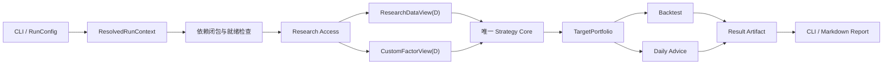

# XQatExp MVP 详细设计文档集

**状态：** 详细设计 1.1 门禁验证中  
**版本：** 1.1  
**修订日期：** 2026-09-05  
**图示格式：** Markdown 内嵌 Mermaid；不使用 JPG

## 1. 上位输入与权威顺序

本设计只读使用以下上位输入，不修改、不重排、不重新发布它们：

| 优先级 | 文件 | SHA-256 |
|---:|---|---|
| 1 | `../../PRD.txt` | `2CC90E04C56ADFCF4B9FA73354D3EF4D6DBE5B88FAE1B23D938D780D185D1148` |
| 2 | `../../总体架构设计.md` | `32D425F69DB9DB02D80079C622BD60B79E2C07780CC45C592A8A2A3C55DF4C15` |

发生冲突时按“PRD → 总体架构 → 详细设计基线 → 共享合同 → 模块文档”的顺序裁决。模块文档不得重新定义共享合同。

## 2. 文档地图

| 编号 | 文档 | 负责范围 |
|---:|---|---|
| 00 | [详细设计基线](00-baseline.md) | 全局决策、时间语义、目录、精度和不变量 |
| 01 | [共享合同](01-shared-contracts.md) | 跨模块类型、Schema、枚举、Protocol、Issue |
| 02 | [CLI 与运行配置](02-cli-and-config.md) | 命令、参数解析、退出码、用例编排 |
| 03 | [Artifact 与存储](03-artifacts-and-storage.md) | Raw、Research、Custom Factor、Result 的物理组织与原子发布 |
| 04 | [原始数据获取与检查](04-raw-data.md) | Tushare 获取、权限、重试、Raw 校验 |
| 05 | [统一研究数据与系统因子](05-research-data-and-factors.md) | 逻辑表、字段、可见性、因子公式、增量构建 |
| 06 | [Research Access 与就绪检查](06-research-access.md) | DuckDB 查询、View 边界、自定义因子、依赖闭包 |
| 07 | [Strategy Core 与内置策略](07-strategy-core.md) | 唯一策略实现、批准策略规则、理论组合回撤 |
| 08 | [组合领域与调仓规划](08-portfolio-and-rebalance.md) | 组合校验、目标数量、取整、现金分配、目标变化 |
| 09 | [回测、执行与模拟账户](09-backtest-and-simulation.md) | 历史推进、成交模拟、费用、公司行为、账户守恒 |
| 10 | [绩效与阶段分析](10-performance-analysis.md) | 收益、风险、换手、集中度、基准和阶段指标 |
| 11 | [每日运行与交易建议](11-daily-run-and-advice.md) | D 日目标、AccountSnapshot、字段级降级、D+1 建议 |
| 12 | [结果、报告与问题语义](12-results-and-issues.md) | Result Manifest、报告、ERROR/WARNING、失败诊断 |
| 13 | [安全、日志与本地运行](13-security-and-operations.md) | 凭证、敏感信息、日志、本地资源边界 |
| 14 | [测试与需求追踪](14-testing-and-traceability.md) | 测试分层、架构不变量证明、PRD 验收映射 |
| 15 | [设计验证报告](15-verification-report.md) | 上位文件保护、覆盖率、链接、图示与合同一致性证据 |
| 16 | [物理 Schema 注册表](16-physical-schemas.md) | Manifest、输入和 Result 文件的字段、类型、主键、版本与消费者合同 |
| 17 | [Python 工程与运行基线](17-engineering-baseline.md) | Python/venv、依赖、包结构、质量门禁、资源与跨平台原子发布 |
| 18 | [可手算黄金向量](18-golden-vectors.md) | 分位数、配置、回撤、数量、费用、公司行为、绩效和确定性验收值 |

## 3. 单一事实来源规则

- 跨模块字段、枚举、状态和接口签名只在 `01-shared-contracts.md` 定义。
- 研究数据物理表只在 `05-research-data-and-factors.md` 定义。
- 策略计算规则只在 `07-strategy-core.md` 定义。
- 费用、成交与账户事件顺序只在 `09-backtest-and-simulation.md` 定义。
- 指标公式只在 `10-performance-analysis.md` 定义。
- Issue 信封和前缀在 `01-shared-contracts.md` 定义，具体 Issue 代码只在 `12-results-and-issues.md` 定义。
- Artifact 信封、运行输入和 Result 物理文件 Schema 只在 `16-physical-schemas.md` 定义；Research 表和用户因子仍分别以 05、06 为准。
- Python 版本、依赖、包结构、工具链、资源默认值和平台发布算法只在 `17-engineering-baseline.md` 定义。
- 模块文档通过链接引用权威定义，不复制出第二套可修改版本。

## 4. 顶层数据流

## 5. 完成判定

本设计集只有在以下条件同时成立时才视为一致：

1. PRD 第 27 章的每个验收项均在追踪矩阵中有设计和测试落点；
2. 总体架构六项不变量均有明确的实现约束和反例测试；
3. 共享字段、枚举、错误码和接口没有重复冲突定义；
4. Mermaid 代码块、相对链接和文档索引可解析；
5. 两份上位输入的 SHA-256 与本页记录一致。
