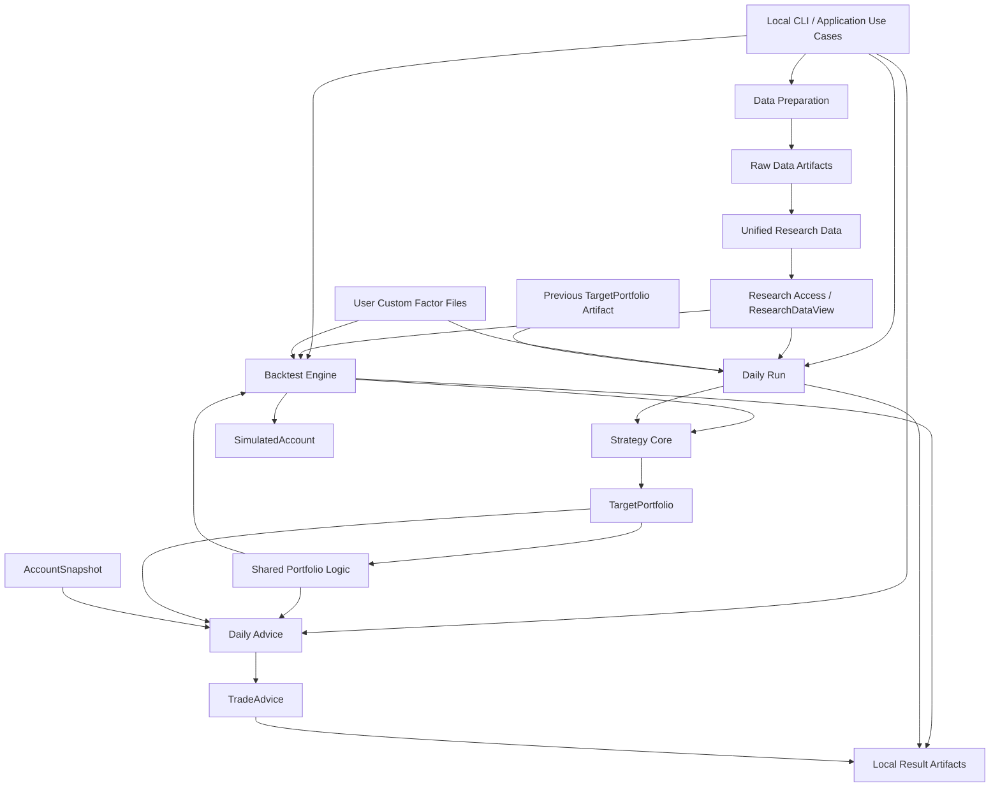

# XQatExp 总体架构设计

**文档状态：最终定稿**  
**适用阶段：MVP 总体架构**  
**产品：XQatExp**  
**日期：2026-08-08**

---

## 1. 文档目的

本文档定义 XQatExp MVP 的最终总体架构。

本文档只描述架构级约束，包括：

- 系统边界与非目标；
- 顶层模块及职责；
- 数据与本地 Artifact 的边界；
- 统一研究数据的责任范围；
- 策略、历史评估和每日运行之间的关系；
- 模拟账户与真实账户之间的隔离；
- 数据访问与未来信息约束；
- 运行、失败、降级和结果保存原则；
- 安全与凭证边界；
- 关键技术决策；
- 必须长期保持成立的架构不变量。

本文档**不定义详细数据字段、文件 Schema、交易公式、费用公式、CLI 参数名、Python 类接口或目录结构**。这些内容属于后续详细设计。

---

## 2. 架构目标

XQatExp 是面向个人 A 股投资者的本地命令行策略研究工具。

总体架构围绕以下目标设计：

1. **研究数据可信**  
   策略只能使用统一、标准化且满足历史信息可见性约束的系统研究数据。

2. **历史评估与每日运行同源**  
   历史评估和每日运行必须调用同一个 Strategy Core，避免两套策略实现产生语义漂移。

3. **回测具有基本交易现实性**  
   历史评估必须显式考虑交易时序、费用、滑点、交易单位、停牌、涨跌停、现金不足、持仓不足以及无法成交等现实约束。

4. **策略目标与实际账户严格分离**  
   策略表达“希望持有什么”，账户和执行层负责“现实中能做到什么”。

5. **每日结果可解释、可执行但不过度承诺**  
   系统能够输出目标持仓和基于当前账户事实的参考交易建议，但不假设尚未发生的未来成交。

6. **保持本地、简单、透明**  
   系统不演化为交易平台、数据平台、工作流平台、账户系统或实验管理平台。

---

## 3. 系统边界

### 3.1 系统负责

XQatExp 负责：

- 从外部数据源准备原始数据；
- 将原始数据转换为统一研究数据；
- 构建由系统负责未来信息约束的系统因子；
- 校验当前运行实际依赖的数据是否可靠可用；
- 加载用户提供的历史自定义因子；
- 运行内置策略并产生目标持仓；
- 执行历史评估；
- 维护回测中的模拟账户；
- 根据用户提供的当前账户事实生成每日交易参考建议；
- 将运行输入、假设、结果和限制保存为本地 Artifact。

### 3.2 系统不负责

XQatExp 不负责：

- 自动交易；
- 券商接入；
- 真实成交确认；
- 真实账户历史维护；
- 根据过去建议推测当前持仓；
- 用户自定义因子的计算逻辑；
- 用户自定义因子的未来信息检查；
- 自动策略参数优化；
- 多策略组合；
- 动态策略插件市场；
- 通用因子平台；
- 通用数据质量平台；
- 通用工作流/DAG 平台；
- 自动牛熊市或市场 Regime 识别；
- 实时或分钟级交易系统；
- 云端、多用户或分布式执行。

---

## 4. 总体架构形态

XQatExp 采用**本地模块化单体**。

MVP 是：

- 一个代码仓库；
- 一个 Python 应用；
- 一个本地 CLI；
- 一个本地进程；
- 本地文件系统上的数据与结果 Artifact。

不引入：

- 微服务；
- HTTP API；
- Web 后端；
- 消息队列；
- 后台守护进程；
- 独立数据库服务；
- 分布式计算。

### 4.1 顶层逻辑架构



图中的组件是**逻辑职责边界**，不是独立服务。

---

## 5. 固定业务阶段与执行模型

XQatExp 使用用户显式驱动的固定业务阶段。

典型流程为：

```text
原始数据准备
    ↓
原始数据检查
    ↓
统一研究数据构建 / 更新
    ↓
统一研究数据检查
    ↓
策略运行
    ↓
目标持仓
    ├──→ 历史评估
    └──→ 每日交易建议
    ↓
本地结果 Artifact
```

架构遵循以下原则：

- 不提供通用工作流编排能力；
- 不维护隐藏的“当前项目状态”；
- 不自动寻找“最新数据”“最新因子”“最新账户”或“最新目标”；
- 每次运行的实际输入必须能够明确确定；
- 有意义的阶段可以独立重新执行；
- 系统不承担 Artifact 历史版本管理。

---

## 6. Artifact 架构

系统使用本地 Artifact 作为阶段之间的主要持久化边界。

存在四类相互独立的 Artifact。

### 6.1 Raw Data Artifacts

Raw Data：

- 保留外部数据源的原始字段和业务语义；
- 面向重建、增量下载、人工检查和问题定位；
- 可以按不同数据源接口采用不同的细粒度文件组织；
- 不直接提供给 Strategy 使用。

原始数据下载不建设长期下载状态数据库。

已有目标文件采用三种明确策略：

- `error`：默认；遇到已有文件时报错；
- `skip`：已有文件直接跳过；
- `overwrite`：重新下载并安全替换已有文件。

`skip` 只表示“存在即跳过”，不表示文件已经通过完整性验证。

### 6.2 Unified Research Data Artifacts

Unified Research Data：

- 由 XQatExp 从 Raw Data 构建；
- 提供稳定、标准化的研究语义；
- 包含系统负责构建的系统因子；
- 是 Strategy 可使用的正式系统研究数据；
- 由 XQatExp 负责历史信息可见性约束。

Unified Research Data 与 Raw Data 是两个不同的产品概念，不能合并。

### 6.3 User Custom Factor Artifacts

用户自定义因子：

- 是用户在系统外部已经计算好的历史因子数据；
- 作为一次运行的显式外部输入；
- 运行前进行格式和可连接性检查；
- 不复制到 Unified Research Data；
- 不进入系统内部因子仓库；
- 不建设版本管理或 Factor Registry。

PRD 中的“导入自定义因子”在架构上的含义是：

> 检查并加载用户提供的外部因子文件，而不是导入到系统管理的数据仓库。

用户负责：

- 因子计算逻辑正确性；
- 因子数据自身的未来信息约束。

### 6.4 Result Artifacts

正式结果以独立本地 Artifact 保存。

结果必须能够回答两个问题：

1. **这次是怎么运行的？**
   - 策略；
   - 实际参数；
   - 数据输入；
   - 自定义因子；
   - 日期范围；
   - 执行假设；
   - 费用和滑点假设；
   - 必要的账户输入。

2. **这次运行得到了什么？**
   - 目标组合；
   - 交易和未成交；
   - 组合路径；
   - 收益与风险；
   - Warning；
   - 限制说明。

正式结果只代表成功运行。

失败不能生成一个看起来像正常成功结果的 Artifact。

结果输出路径由用户明确指定。已有结果默认报错，可显式覆盖；结果计算不使用“已有就 skip”的语义。

---

## 7. Data Preparation

Data Preparation 负责从外部数据到统一研究数据的完整准备过程。

```text
External Data Source
        ↓
Raw Data
        ↓
Validation
        ↓
Standardization
        ↓
Historical-state reconstruction
        ↓
System-factor construction
        ↓
Unified Research Data
```

### 7.1 Raw Data Acquisition

原始数据获取：

- 采用数据集特定的直接实现；
- 可以复用公共网络访问、限流、重试和安全写入能力；
- 不建设通用采集平台；
- 不维护持久化下载状态、请求账本或缺口数据库；
- 用户每次显式指定下载数据集及范围。

下载阶段只承担最低限度的输入合理性检查，不承担完整数据质量治理。

### 7.2 Full Build 与 Incremental Update

Unified Research Data 支持：

- 完整构建；
- 增量更新。

增量更新的目标是减少不必要的重新计算，但最终发布的 Unified Research Data Artifact 必须是内部一致的完整产物。

不能出现一个正式 Artifact 同时包含“部分新数据”和“部分尚未完成更新的数据”的中间状态。

### 7.3 Validation

数据检查是 Data Preparation 内部的可复用能力，而不是独立 Data Quality 子系统。

检查遵循：

```text
Check = 发现并报告
Build = 按明确规则转换
```

两者都不得进行猜测性的自动修复。

验证只执行能够由明确业务规则确定的检查，例如：

- 文件是否存在且可读取；
- 必需字段是否存在；
- 业务键是否重复；
- 输入范围是否一致；
- 必需日期或证券是否覆盖；
- 统一数据中的引用关系和确定性业务约束是否成立；
- 系统因子的合法历史覆盖是否满足。

不建设统计异常检测、自动插值、自动填充或跨数据供应商一致性平台。

---

## 8. 依赖范围内的数据可用性

系统是否允许某次策略运行，必须根据**当前 Use Case 和当前 Strategy 的实际依赖范围**判断。

流程为：

```text
Strategy Declaration
        ↓
Required Data Dependency Set
        ↓
Readiness Check
        ↓
Run / Fail
```

因此：

- 当前策略不依赖的数据缺失，不得阻止该策略运行；
- 当前策略不需要的数据源权限不足，不得阻止该策略运行；
- 当前策略明确必需的数据无法可靠提供时，运行必须失败；
- 策略声明了明确缺失处理规则时，才允许按照该规则继续。

这一原则防止系统因为无关数据问题而整体不可用。

---

## 9. Research Access

Strategy 与数据存储之间存在硬边界。

### 9.1 持久化与查询

Unified Research Data 的主要持久化格式采用 **Parquet**。

数据访问采用 **进程内 DuckDB** 作为主要关系型查询引擎。

DuckDB：

- 直接查询本地研究数据；
- 承担筛选、连接和必要的简单聚合；
- 仅存在于运行进程中；
- 不建立或维护持久化 DuckDB 数据库。

Parquet 是正式持久化事实，DuckDB 是查询实现。

MVP 不同时引入另一套平行的主要查询框架。

### 9.2 Strategy 不接触存储实现

Strategy 不得：

- 读取 Raw Data；
- 调用 Tushare；
- 打开 Parquet；
- 打开用户因子 CSV；
- 接触文件路径；
- 执行 SQL；
- 持有 DuckDB connection。

所有研究数据先由数据访问层组装为受约束的研究输入，再交给 Strategy。

### 9.3 ResearchDataView 与 ExecutionDataView 分离

必须保留两个不同的信息边界。

**ResearchDataView(D)** 回答：

> 在 D 日收盘后的策略决策时点，策略合法能够知道什么？

**ExecutionDataView(T)** 回答：

> 当历史模拟已经推进到交易日 T 时，执行和估值层能够知道哪些已经发生的市场事实？

二者不能合并成任意查询接口。

这是防止未来信息泄漏的核心架构隔离。

---

## 10. 系统因子与用户因子

### 10.1 系统因子

系统因子属于 Unified Research Data 构建过程。

每个系统因子在代码中静态声明：

- 业务含义；
- 输入依赖；
- 历史回看需求；
- 合法缺失规则；
- 适用对象；
- 可供策略使用的历史时点语义。

XQatExp 对系统因子的历史信息可见性负责。

不建设通用 Factor Platform。

### 10.2 用户自定义因子

用户因子属于 Strategy 的外部研究输入。

XQatExp 只负责：

- 基础格式检查；
- 证券与日期连接；
- 按策略声明加载需要的因子。

XQatExp 不验证：

- 因子计算公式；
- 因子构造代码；
- 因子是否使用未来信息。

任何依赖用户自定义因子的正式结果都必须携带明确限制说明：

> 该因子由用户提供，XQatExp 未验证其计算逻辑，也未验证其历史信息可见性。

---

## 11. Strategy Core

Strategy Core 是历史评估和每日运行共享的唯一策略实现。

### 11.1 Strategy 声明

每个策略静态声明：

- 所需研究数据；
- 所需系统因子；
- 所需用户因子；
- 参数；
- 历史 lookback；
- 缺失数据处理规则；
- 决策日规则。

MVP 的策略由代码内置。

增加策略可以修改代码，但不建设：

- 动态插件发现；
- Strategy SDK；
- 外部策略脚本市场；
- 运行时动态加载框架。

### 11.2 Strategy 输入与输出

Strategy Core 的逻辑形式为：

```text
ResearchDataView
+ Custom Factors
+ Parameters
        ↓
    Strategy Core
        ↓
  TargetPortfolio
```

Strategy Core 不读取 previous target，不读取模拟账户，也不读取真实账户。

Strategy 本身不得：

- 进行文件 I/O；
- 更新数据；
- 读取账户；
- 模拟成交；
- 生成券商订单；
- 生成报告。

### 11.3 TargetPortfolio

TargetPortfolio 表达：

- 目标证券；
- 目标权重；
- 现金目标；
- 产生目标的主要策略解释信息。

Strategy 必须能够解释“为什么产生这些目标”，因为下游模块无法可靠反向推断策略原因。

Strategy 不产生：

- 目标金额；
- 目标股数；
- 买卖订单；
- 实际成交。

---

## 12. Previous Target 与目标状态变化

Previous TargetPortfolio 不是 Strategy Core 的输入。

它用于：

```text
Previous TargetPortfolio
        +
Current TargetPortfolio
        ↓
Target Transition Annotation
```

从而形成：

- NEW；
- RETAIN；
- EXIT；
- 增持/减持等目标变化描述。

### 12.1 Backtest

BacktestEngine 在自身历史时间推进过程中维护上一期 TargetPortfolio。

### 12.2 Daily Run

每日运行需要比较上一目标时，由用户显式指定已有 TargetPortfolio Artifact。

系统：

- 不维护隐藏的“上一目标”；
- 不扫描目录自动选择 latest；
- 不从真实账户反推上一策略目标。

第一次没有上一目标时，采用明确的初始目标比较语义；具体表达方式属于详细设计。

---

## 13. Shared Portfolio Logic

历史评估与每日建议共享少量真正相同的组合规则。

共享领域能力包括：

- TargetPortfolio 合法性校验；
- 现金作为一等组合组成部分；
- 非负权重和非杠杆约束；
- 交易单位规则；
- 目标权重向理论目标数量的转换；
- 当前组合与目标组合之间的理论调仓差异。

这组能力可以由 RebalancePlanner 等实现承担，但它不是独立服务，也不是通用 Portfolio Platform。

它只回答：

> 理论上应该调整到什么状态？

它不回答：

> 市场实际上是否成交？

---

## 14. Backtest

Backtest 是一个封闭的历史时间推进环境。

### 14.1 控制方向

BacktestEngine 是 Strategy Core 的调用者。

```text
Historical Time
      ↓
到达 Decision Day D
      ↓
构造 ResearchDataView(D)
      ↓
调用同一个 Strategy Core
      ↓
TargetPortfolio
      ↓
后续交易日执行模拟
      ↓
更新 SimulatedAccount
      ↓
估值与记录
      ↓
继续历史时间推进
```

Backtest 不是消费外部预先生成的整段 TargetPortfolio 序列。

### 14.2 时间语义

MVP 的策略决策时点为：

> 交易日 D 收盘后。

D 日策略目标只能在后续交易日执行。

Backtest 必须按照真实历史时间顺序推进，不能因为数据已经存在于磁盘上就允许 Strategy 使用未来事实。

### 14.3 SimulatedAccount

Backtest 独立维护模拟账户状态，包括：

- 现金；
- 实际模拟持仓；
- 必要的待结算确定性权益；
- 已发生的模拟交易；
- 费用影响。

SimulatedAccount 与真实用户账户是完全不同的类型和责任边界。

### 14.4 Target 与 Actual 分离

执行限制只能改变实际模拟组合，不能反向修改 Strategy 已经产生的 TargetPortfolio。

因此：

```text
TargetPortfolio
    ≠
Actual Simulated Portfolio
```

停牌、涨跌停、现金不足或其他执行限制造成未成交时：

- Target 保持不变；
- Actual Portfolio 按真实模拟结果演化；
- 未成交及原因进入正式结果。

MVP 不支持执行反馈反过来改变下一期策略选股逻辑的策略。

### 14.5 交易现实性

Backtest Execution 必须显式处理：

- 交易费用；
- 税费；
- 滑点；
- 交易单位；
- 停牌；
- 涨跌停；
- 现金不足；
- 持仓不足；
- 无法成交；
- 公司行为对模拟账户的确定性影响。

具体价格模型、费用公式、股数取整和现金不足分配算法属于详细设计。

### 14.6 价格语义隔离

架构必须区分三种业务语义：

- **Research Price**：供 Strategy 进行研究计算；
- **Execution Price**：供 Backtest 模拟成交；
- **Valuation Price**：供模拟账户估值。

研究连续价格不能直接用于实际账户价值或成交金额计算。

公司行为对研究价格连续性的处理，与公司行为对模拟账户现金/持股数量的处理，是两个不同职责，不能互相替代。

### 14.7 历史阶段分析

历史结果分析支持：

- 全区间；
- 年度；
- 用户明确指定的历史日期区间。

MVP 不建设自动牛熊市或市场 Regime 分类引擎。

---

## 15. Daily Run

Daily Run 与 Backtest 共享同一个 Strategy Core。

流程为：

```text
D 日收盘后可知的研究数据
+ Custom Factors
+ Parameters
        ↓
同一个 Strategy Core
        ↓
TargetPortfolio for next trading day
```

Daily Run 不能：

- 使用下一交易日事实；
- 读取用户实际账户来改变 Strategy 目标；
- 预测下一交易日实际成交情况。

如果需要展示 NEW / RETAIN / EXIT，上一 TargetPortfolio 必须由用户显式指定。

---

## 16. Daily Advice

Daily Advice 将独立的策略目标转换成基于当前账户事实的参考交易建议。

```text
TargetPortfolio
+ AccountSnapshot
+ 当前已知参考信息
+ Shared Portfolio Logic
        ↓
TradeAdvice
```

### 16.1 AccountSnapshot

AccountSnapshot 是用户在当前运行时显式提供的一次性券商事实。

它代表：

> 本次策略实际管理范围内的当前账户事实。

系统不维护：

- 真实账户数据库；
- 影子账户；
- 历史真实成交；
- 自动持仓推演；
- 下一日预计账户快照。

下一次每日建议必须重新依据用户提供的真实账户事实。

### 16.2 当前账户与策略目标分离

TargetPortfolio 不依赖 AccountSnapshot。

即使没有账户信息，只要 Strategy 输入完整，系统仍然可以产生 TargetPortfolio。

账户信息只影响 TradeAdvice。

### 16.3 每日信息边界

Daily Advice 只使用当前已经可靠知道的信息。

它不得假设：

- 下一交易日一定能够卖出；
- 预计卖出所得已经成为可用现金；
- 下一交易日停牌状态；
- 下一交易日涨跌停状态；
- 下一交易日真实成交价格。

因此，Daily Advice 可以表达：

- 理论目标差异；
- 当前信息支持的参考交易动作；
- 尚未解决的差异；
- 限制原因。

未知值必须明确保持未知，不能使用 `0` 等业务值伪装成已知。

---

## 17. Backtest 与 Daily Advice 的关系

Backtest 和 Daily Advice 是**平级消费者**，不是上下级关系。

```text
                    Strategy Core
                       ▲      ▲
                       │      │
                 Backtest   Daily Run
                       │      │
                       └─ TargetPortfolio
                             │
                 ┌───────────┴───────────┐
                 ▼                       ▼
        Backtest Execution          Daily Advice
                 │                       │
        SimulatedAccount           AccountSnapshot
```

二者共享：

- Strategy Core；
- TargetPortfolio 语义；
- 组合合法性规则；
- 交易单位和理论调仓计算等 Shared Portfolio Logic。

二者不共享：

- 未来信息；
- 账户状态；
- 成交事实。

Daily Advice 不通过“运行一次 Backtest”来模拟明天。

---

## 18. 结果与展示

正式结构化结果是事实来源。

结果展示可以包括：

- CLI 摘要；
- Markdown 报告；
- 其他简单的人类可读格式。

展示层只能格式化已经计算完成的结构化结果，不得重新实现收益、回撤、交易统计等核心业务算法。

因此架构上不存在独立 Reporting 子系统。

---

## 19. 错误、Warning 与可靠降级

系统采用统一、简单的业务问题语义：

- `ERROR`：无法可靠完成当前任务；
- `WARNING`：任务可以可靠完成，但存在用户需要知道的限制或异常。

不建设 Issue Database、Issue Lifecycle 或复杂 severity 体系。

### 19.1 命令失败与交易未实现不同

以下属于正常业务结果，而不是系统失败：

- 股票停牌导致未成交；
- 涨跌停导致未成交；
- 现金不足导致无法完成全部目标；
- 交易单位导致目标权重存在偏差；
- 当前可卖数量不足。

这些情况应正常保存正式结果和原因。

以下情况意味着当前任务无法可靠完成，应失败：

- Strategy 必需数据缺失且没有合法缺失处理规则；
- Strategy 参数非法；
- 历史账户无法可靠估值；
- 历史信息可见性无法确定；
- 关键输入损坏或冲突。

### 19.2 Backtest 不允许部分成功

正式历史评估只有：

- SUCCESS；
- FAILED。

成功结果可以包含 Warning，但不引入“部分成功回测”。

Backtest 不得因为某个必需决策日的数据问题而静默跳过该决策日继续计算完整收益路径。

### 19.3 Daily Advice 可以字段级降级

每日建议允许在不污染已知结果的前提下局部降级。

例如可卖数量未知时：

- 仍可表达理论减仓目标；
- 不能声称一个无法确认的精确可卖数量。

---

## 20. CLI 与运行配置

CLI 只暴露固定的业务阶段，不提供通用工作流语言。

复杂业务运行可以使用一个显式运行配置文件。

业务参数解析优先级为：

```text
CLI 显式值
    >
运行配置文件
    >
代码公开默认值
```

环境变量不用于偷偷覆盖普通策略或回测业务参数。

数据路径、用户因子、账户输入和输出路径必须被明确确定，不自动发现“latest”。

影响研究结果的默认值允许存在，但最终解析值必须：

- 在运行开始前向用户展示；
- 写入正式结果上下文。

运行前展示最终解析配置，但不要求交互式 `yes/no` 确认。

日志只用于诊断。影响研究结论的重要事实必须进入正式结果或检查报告，不能只存在日志中。

---

## 21. 安全与凭证边界

外部数据服务凭证是明确的外部安全边界。

```text
Local Secret Source
        ↓
Raw Data Acquisition
        ↓
External Data Provider
```

凭证只允许进入真正需要调用外部数据服务的最小边界。

凭证不得进入：

- 普通运行配置；
- Raw Data Artifact；
- Unified Research Data；
- Custom Factor Artifact；
- TargetPortfolio；
- Backtest Result；
- TradeAdvice；
- Markdown 报告；
- 日志；
- 错误信息。

MVP 可以通过环境变量或其他本地秘密机制提供凭证。

不自行建设加密 Secret Store、主密码系统或凭证管理平台。

---

## 22. Artifact 发布与覆盖原则

正式 Artifact 写入采用安全发布语义：

```text
临时位置完整生成
        ↓
必要校验
        ↓
原子发布 / 替换
```

不能让用户看到“半写完”的正式 Artifact。

系统不自动：

- 编号版本；
- 创建 latest 指针；
- 维护版本索引；
- 保存历史版本数据库。

是否保留旧产物由用户通过不同输出路径决定。

---

## 23. 关键技术决策

以下技术决策属于总体架构的一部分。

### 23.1 部署

- 本地 Python 应用；
- CLI；
- 单进程；
- 模块化单体。

### 23.2 数据持久化

- Raw Data 保持接近来源语义的本地细粒度文件；
- Unified Research Data 主要使用 Parquet；
- User Custom Factors 保持为外部用户文件；
- Result Artifact 使用适合结构化数据和人类阅读的本地文件组合。

### 23.3 数据查询

- DuckDB 作为进程内主要研究数据查询引擎；
- 不维护持久 DuckDB 数据库；
- DuckDB 不泄漏到 Strategy API；
- 不并行建设另一套主要查询框架。

### 23.4 扩展方式

- Strategy 代码级扩展；
- 数据源代码级扩展；
- 不建设动态 Strategy Plugin Framework；
- 不建设 Data Source Plugin Framework；
- 只有出现第二个真实需求时才抽象共同扩展接口。

---

## 24. 六项核心架构不变量

以下六条是 XQatExp 的最高级架构合同。实现、重构和详细设计不得破坏。

### 24.1 历史可见性

在决策日 D：

> Strategy 只能看到 D 日盘后决策时已经合法可知的信息。

任何未来数据泄漏都是架构级错误。

### 24.2 策略同源性

Backtest 与 Daily Run：

> 必须调用同一个 Strategy Core。

不能分别维护“回测版策略”和“实盘建议版策略”。

### 24.3 策略确定性

在相同的：

- ResearchDataView；
- Custom Factors；
- Strategy Parameters；

条件下：

> Strategy Core 必须产生业务含义一致的 TargetPortfolio。

Strategy 不依赖 previous target、模拟账户或真实账户。

### 24.4 模拟账户守恒

Backtest 中：

> 现金、持股数量和账户权益只能通过明确的交易、费用、公司行为和其他已定义账户事件发生变化。

资产不能凭空产生或消失。

### 24.5 依赖局部性

> 与本次 Use Case 或 Strategy 无关的数据缺失、权限不足或问题不得阻断本次运行。

是否可运行由当前实际依赖闭包决定。

### 24.6 真实账户隔离

> XQatExp 永远不根据过去建议或模拟结果推测用户当前真实账户。

每次需要真实账户事实时，都必须来自用户当前显式提供的券商信息。

---

## 25. 非目标

MVP 明确不建设以下能力：

- Web 或桌面 GUI；
- 云端 SaaS；
- 多用户；
- 实时或分钟级数据与交易；
- 自动调度；
- 自动交易；
- 券商 API；
- 真实账户数据库；
- 自动对账；
- 策略动态插件市场；
- 任意用户策略代码加载；
- 通用因子研究平台；
- 参数自动搜索和优化；
- 多策略组合；
- 分布式计算；
- 通用 Workflow / DAG Engine；
- 独立数据库服务；
- Data Quality Platform；
- Experiment Tracking Platform；
- Artifact Version Management Platform；
- 自动市场 Regime 识别。

未来可以在明确需求出现后扩展，但 MVP 不为这些可能性提前支付架构复杂度。

---

## 26. 留给详细设计阶段的内容

以下问题明确不在总体架构中定死，将在详细设计阶段逐项确定：

- Unified Research Data 的具体逻辑表和字段；
- 证券标识具体格式；
- 日期、空值和数据类型的字段级规则；
- Parquet 的具体分区与目录命名；
- User Custom Factor CSV 的具体 Schema；
- 系统因子的具体存储 Schema；
- Corporate Action 的具体字段模型；
- TargetPortfolio 的具体字段；
- Target Transition 的具体表示；
- AccountSnapshot 的具体文件格式与字段；
- TradeAdvice 的具体字段；
- Result Artifact 的具体文件名和 Manifest Schema；
- Issue 的具体字段；
- 交易单位的具体数值规则；
- 目标股数取整算法；
- 现金不足时的具体买入分配算法；
- 费用、税费和最低佣金公式；
- 滑点公式；
- 涨跌停和停牌的具体日线判定规则；
- 公司行为的具体账户处理顺序；
- 回测收益、风险、换手等指标公式；
- CLI 的具体命令名和参数；
- Python 包目录、类、Protocol 和函数接口；
- 自动化测试的具体组织方式。

已经确认的总体架构是这些详细设计的约束条件，而不是其替代品。

---

## 27. 最终架构结论

XQatExp MVP 最终采用：

> **本地模块化单体 + 显式分阶段 Artifact 流程 + Raw/Research 数据分离 + Parquet 持久化 + 进程内 DuckDB 查询 + 受限 ResearchDataView + 单一 Strategy Core + 独立 Backtest 与 Daily Advice + SimulatedAccount/真实 AccountSnapshot 强隔离。**

架构的核心不是组件数量，而是以下责任边界：

```text
Raw Data
    ↓
Unified Research Data
    ↓
ResearchDataView
    ↓
Strategy Core
    ↓
TargetPortfolio
   /             \
Backtest       Daily Advice
   |                |
Simulated       Real Account
Account          Snapshot
```

系统只对自己能够可靠负责的事实负责：

- XQatExp 负责系统研究数据和系统因子的历史信息可见性；
- 用户负责用户自定义因子的计算及未来信息约束；
- Strategy 负责目标；
- Backtest 负责历史模拟执行；
- 用户提供的券商事实负责真实账户；
- Daily Advice 只基于当前可知事实提供参考，不预测未来成交。

在这一边界下，MVP 能够形成完整、可信、可复现、可解释的策略研究闭环，同时避免提前建设与产品目标无关的平台型能力。

**本总体架构至此冻结。后续工作进入详细设计阶段。**
